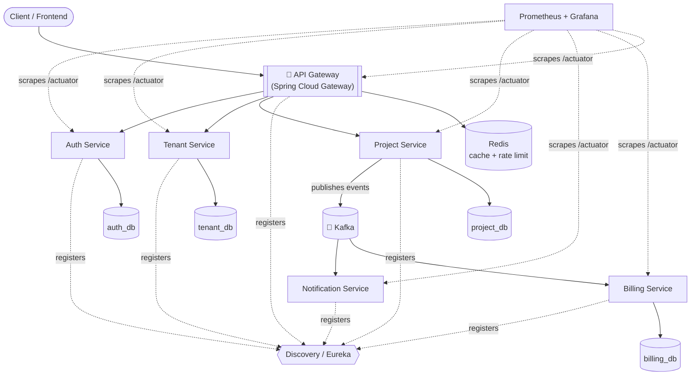
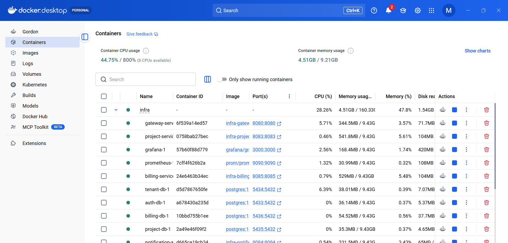
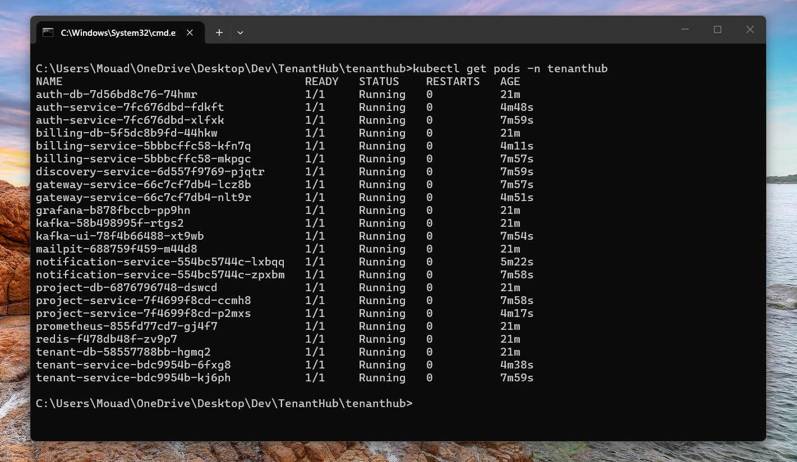
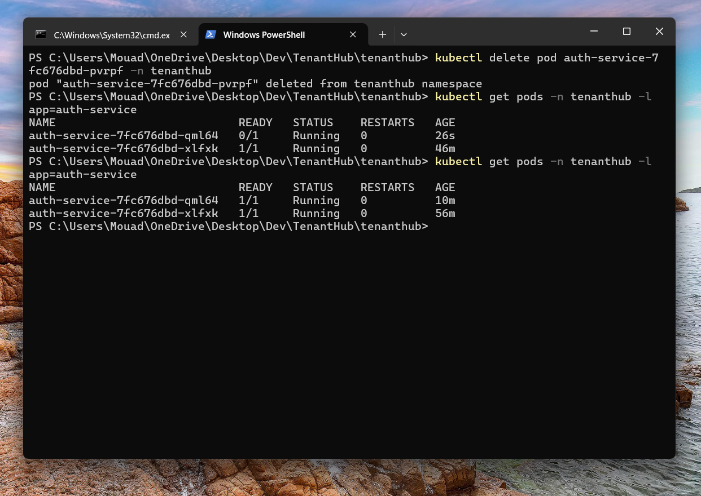
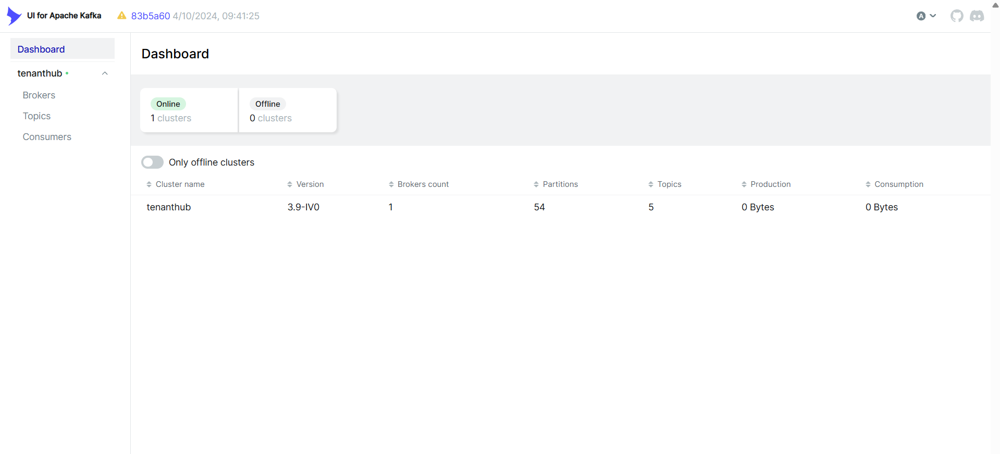
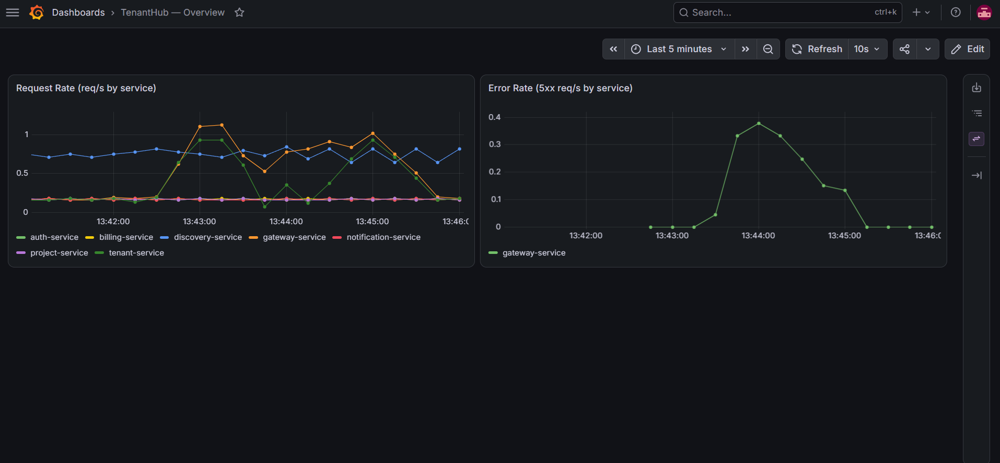

<div align="center">

# TenantHub

**A multi-tenant, event-driven SaaS project management platform**

Built as a Spring Boot microservices system — Jira-style project management, wrapped in
tenant isolation, JWT auth, async messaging, and production-grade observability.


</div>

---

## Table of Contents

- [Overview](#overview)
- [Architecture](#architecture)
- [Services](#services)
- [Multi-Tenancy Model](#multi-tenancy-model)
- [Tech Stack](#tech-stack)
- [Database Design](#database-design)
- [Use Cases](#use-cases)
- [Event Flow — A Worked Example](#event-flow--a-worked-example)
- [Resources](#resources)
- [Getting Started](#getting-started)
- [Repository Structure](#repository-structure)

---

## Overview

TenantHub is a backend platform for teams to manage projects, tasks, and collaboration —
built the way a real SaaS product would be: multiple companies (**tenants**) sharing one
platform, each with data that's fully isolated from the others, behind a single API
gateway, communicating asynchronously through events rather than tightly-coupled calls.

It's a deliberately over-engineered portfolio project in the good sense — it exists to
demonstrate production-grade backend patterns end to end: service decomposition,
database-per-service isolation, JWT-based tenant scoping, event-driven decoupling via
Kafka, service discovery, and observability, not just a CRUD API with extra steps.

## Architecture



Every box is its own Spring Boot application, with its own database, and (eventually) its
own Docker container. Requests come in through one door (the Gateway); side effects fan
out through Kafka to whichever services care, without the originating service ever
knowing who's listening.

## Services

| Service | Responsibility | Port | Database |
|---|---|---|---|
| `gateway-service` | Single entry point — JWT validation, request routing, per-tenant rate limiting | `8080` | — |
| `auth-service` | Registration, login, JWT issuance, RBAC | `8081` | `auth_db` |
| `tenant-service` | Tenant (company) accounts, subscription plans, signup | `8082` | `tenant_db` |
| `project-service` | Core domain — projects, tasks, comments | `8083` | `project_db` |
| `notification-service` | Kafka consumer — emails/webhooks on task & tenant events | `8084` | `notif_db` *(optional)* |
| `billing-service` | Usage tracking, plan-limit enforcement, invoicing | `8085` | `billing_db` |
| `discovery-service` | Eureka service registry | `8761` | — |
| `shared-events` | Shared event payload contracts (library, not a deployable service) | — | — |

## Multi-Tenancy Model

Tenant isolation is enforced at two layers:

1. **In transit** — every JWT issued by `auth-service` carries `userId`, `tenantId`, and
   `roles`. Every downstream request is scoped to that `tenantId`; a user from Tenant A
   can never see Tenant B's data, even by guessing an ID.
2. **At rest** — each service owns its own database (**database-per-service**). No
   service ever queries another service's tables directly. `tenant_id` shows up as a
   plain column in most tables, but it is *never* a real foreign key across databases —
   Postgres can't enforce a constraint against a table it can't see. Cross-service
   consistency (e.g. cleaning up a deleted tenant's data) is instead maintained through
   **events**, not transactions.

This is the standard microservices trade-off: you give up database-level referential
integrity across service boundaries in exchange for services that deploy, scale, and
evolve independently.

## Tech Stack

| Layer | Technology |
|---|---|
| Language | Java 17 |
| Framework | Spring Boot 4.1.0 |
| Microservices | Spring Cloud 2025.1.2 (Gateway, Netflix Eureka) |
| Security | Spring Security, JWT ([jjwt](https://github.com/jwtk/jjwt)), OAuth2 Resource Server |
| Messaging | Apache Kafka |
| Persistence | Spring Data JPA, PostgreSQL (one database per service), Flyway |
| Caching | Redis |
| Build | Maven — multi-module monorepo |
| Observability | Spring Boot Actuator, Micrometer, Prometheus, Grafana |
| Containerization | Docker (Compose), Kubernetes |

## Database Design

Five databases total — one per service, each fully private:

| Database | Owning Service | Key Tables |
|---|---|---|
| `auth_db` | auth-service | `users`, `roles`, `user_roles` |
| `tenant_db` | tenant-service | `tenants`, `plans` |
| `project_db` | project-service | `projects`, `tasks`, `comments` |
| `billing_db` | billing-service | `invoices`, `usage_records` |
| `notif_db` *(optional)* | notification-service | `notification_log` |

Real foreign keys only ever exist *within* a single service's database (e.g.
`projects → tasks → comments` inside `project_db`). Links that cross a service boundary
(`tenant_id`, `assignee_user_id`, `author_user_id`) are logical references, resolved over
the network or trusted from a validated JWT — never a cross-database join.

## Use Cases

| Actor | Represents | Example Use Cases |
|---|---|---|
| 👤 Member | Regular team member | Create/view/comment on tasks, filter tasks |
| 🛡️ Tenant Admin | Manages one company | Create projects, assign roles, manage plan |
| 👑 Platform Owner | Runs TenantHub itself | Suspend a tenant, manage plans, view revenue |
| ⚙️ System | Event-triggered, no human involved | Send notifications, record usage, generate invoices |

`System` is a first-class actor here: Notification and Billing Service never get called
directly — every one of their use cases starts with a Kafka event arriving.

## Event Flow — A Worked Example

**"Assign a task to a teammate"**, traced end to end:

```
Member clicks "Assign" in the UI
        │
        ▼
Gateway validates the JWT, routes to Project Service
        │
        ▼
Project Service updates assigneeUserId in project_db
        │
        ▼
Project Service publishes "task.assigned" to Kafka
        │
        ├──────────────────────────┐
        ▼                          ▼
Notification Service         Billing Service
emails the assignee          records usage against the plan
```

One human action fans out into multiple independent system reactions. Project Service
never calls Notification or Billing Service directly, and never waits on them — it
publishes the event and moves on. Adding a fourth listener tomorrow requires zero changes
to Project Service's code.

## Resources

Deeper, screenshot-backed documentation for each operational piece lives in `docs/` —
written against the actual running stack, not just the manifests:

| Doc | Covers |
|---|---|
| [`docs/docker.md`](docs/docker.md) | The 17-container Compose stack — build vs. pulled images, startup order, volumes |
| [`docs/kubernetes.md`](docs/kubernetes.md) | `infra/k8s/` manifests on Docker Desktop — image gotchas, scaling, self-healing |
| [`docs/eureka.md`](docs/eureka.md) | Service registry — how the gateway looks up instances, why restarts cause transient 503s |
| [`docs/kafka-mailpit.md`](docs/kafka-mailpit.md) | Event topics, consumer groups, a task-assignment email landing in Mailpit |
| [`docs/redis.md`](docs/redis.md) | Token-bucket rate limiting shared across gateway replicas |
| [`docs/prometheus-grafana.md`](docs/prometheus-grafana.md) | Metrics scraping, the Request Rate / Error Rate dashboard, a captured live outage |
| [`docs/apis.md`](docs/apis.md) | Per-service Swagger UI, which endpoints are public vs. JWT-protected |

A few of what's in there:

<table>
<tr>
<td width="50%"><br/><sub><b>Docker</b> — all 17 containers in the Compose stack</sub></td>
<td width="50%"><br/><sub><b>Kubernetes</b> — the same stack on Docker Desktop's cluster, every pod healthy</sub></td>
</tr>
<tr>
<td width="50%"><br/><sub><b>Kubernetes</b> — deleting a pod, watching the Deployment replace it automatically</sub></td>
<td width="50%"><br/><sub><b>Eureka</b> — all 6 app services registered and UP</sub></td>
</tr>
<tr>
<td width="50%"><br/><sub><b>Kafka</b> — topics, partitions, and consumer groups</sub></td>
<td width="50%"><br/><sub><b>Grafana</b> — a real outage caught live on the Error Rate panel</sub></td>
</tr>
</table>

## Getting Started

**Prerequisites:** JDK 17+, Maven (or the bundled `./mvnw` wrapper in each module).

```bash
# Clone and enter the repo
git clone <this-repo-url>
cd tenanthub

# Each service ships a safe-to-commit application.yml.example.
# Copy it to a real (gitignored) application.yml before running a service:
cp auth-service/src/main/resources/application.yml.example \
   auth-service/src/main/resources/application.yml

# Build the whole reactor
mvn clean install
```

A full local stack (Postgres, Kafka, Redis, Eureka, all services) runs via
`infra/docker-compose.yml`, or on Kubernetes via the manifests in `infra/k8s/` — see
[`docs/docker.md`](docs/docker.md) and [`docs/kubernetes.md`](docs/kubernetes.md).

## Repository Structure

```
tenanthub/
├── auth-service/            # Authentication, JWT, RBAC
├── tenant-service/          # Tenant accounts & plans
├── project-service/         # Core domain: projects, tasks, comments
├── notification-service/    # Kafka consumer → email/webhook delivery
├── billing-service/         # Usage tracking & invoicing
├── gateway-service/         # Spring Cloud Gateway — single entry point
├── discovery-service/       # Eureka service registry
├── shared-events/           # Shared event payload contracts (plain library)
├── infra/                   # docker-compose.yml, k8s manifests, prometheus.yml
└── pom.xml                  # Maven multi-module aggregator
```
