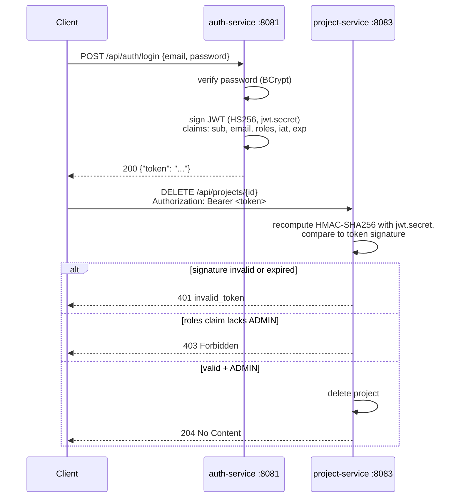

# auth-service

Registration, login, password hashing, and JWT issuance for TenantHub. Every other
service in the system trusts a token this service signed — it's the "badge office"
(see `tenanthub-db-schemas.html`): it only knows who you are and what roles you hold,
nothing about the actual work (projects/tasks/tenants).

| | |
|---|---|
| Port | `8081` |
| Database | `auth_db` (Postgres, schema managed by Hibernate `ddl-auto=update`) |
| Tables | `users`, `roles`, `user_roles` (join table) |

## Endpoints

### `POST /api/auth/register`

```
curl -X POST http://localhost:8081/api/auth/register \
  -H "Content-Type: application/json" \
  -d '{"email":"jane@tenanthub.com","password":"password123"}'
```

- `email` must be well-formed, `password` must be at least 8 characters (Bean
  Validation on `RegisterRequest`) → otherwise `400`.
- Duplicate email → `409 Conflict`.
- On success: creates the user, hashes the password, assigns the default `MEMBER`
  role, and returns a signed JWT → `201 Created`:
  ```json
  { "token": "eyJhbGciOiJIUzI1NiJ9...." }
  ```

### `POST /api/auth/login`

```
curl -X POST http://localhost:8081/api/auth/login \
  -H "Content-Type: application/json" \
  -d '{"email":"jane@tenanthub.com","password":"password123"}'
```

- Correct credentials → `200` with a fresh signed JWT.
- Wrong password **or** unknown email → the same `401` with the same generic message
  (`"Invalid email or password"`). This is deliberate: a login endpoint that gives a
  different error for "no such user" vs. "wrong password" lets an attacker enumerate
  which emails are registered. One exception, one message, regardless of which check
  failed.

Both error shapes (and validation errors) go through `GlobalExceptionHandler`, which
returns a consistent `ErrorResponse` body: `timestamp`, `status`, `error`, `message`,
`path`.

### `GET /internal/users/{id}` — server-to-server only

```
curl http://localhost:8081/internal/users/{id}
```

→ `{"id": "...", "email": "..."}`, or `404` if unknown. Added for
`notification-service` to resolve a Kafka event's `assigneeUserId` into an email
address (see `shared-events/README.md`). Deliberately **not** part of the public
API above — no JWT check, since there's no human in this call, just one service
asking another. Permitted through `SecurityConfig` alongside `/api/auth/**`. There's
no service-to-service auth yet (API key, mTLS, etc.) — anyone who can reach this
port can call it. That's a known gap, to be closed once the Gateway (P5) exists.

## Data model

```
users                          roles
├── id (UUID, PK)              ├── id (UUID, PK)
├── tenant_id (UUID, nullable) └── name (varchar, unique - e.g. "MEMBER", "ADMIN")
├── email (varchar, unique)
├── password_hash (varchar)
└── created_at (timestamp)

user_roles (join table)
├── user_id → users.id
└── role_id → roles.id
```

`tenant_id` is a **logical** link, not a real foreign key — `auth_db` is a separate
database from `tenant_db`, and stays unpopulated until Tenant Service's signup flow
lands in P3. A user can hold multiple roles (`@ManyToMany`, `User` is the owning side).

## Password hashing

`security/SecurityConfig` exposes a `BCryptPasswordEncoder` bean. `AuthService` calls
`passwordEncoder.encode(...)` on register and `passwordEncoder.matches(...)` on login —
the raw password is never stored or compared directly, only its bcrypt hash.

## The JWT process, end to end

This is the part worth being able to explain line by line. There are two separate
concerns: **auth-service signs**, **project-service verifies** — and both sides have to
agree on exactly how, or verification silently fails.

### 1. Signing a token (`security/JwtService`, in auth-service)

On every successful register/login, `JwtService.generateToken(user)` builds a JWT with:

- **Header**: `{"alg":"HS256"}` — HMAC-SHA256, a *symmetric* algorithm (same key signs
  and verifies, unlike RSA's public/private key pair).
- **Claims (payload)**:
  - `sub` — the user's UUID
  - `email` — for convenience, so a consumer doesn't need a lookup just to know who's calling
  - `roles` — array of role names, e.g. `["MEMBER"]` or `["ADMIN","MEMBER"]`
  - `iat` — issued-at timestamp
  - `exp` — expiry, `now + jwt.expiration-ms` (default 1 hour)
- **Signature**: `HMAC-SHA256(base64(header) + "." + base64(payload), jwt.secret)`

```java
this.key = new SecretKeySpec(secret.getBytes(StandardCharsets.UTF_8), "HmacSHA256");
...
Jwts.builder()
    .subject(user.getId().toString())
    .claim("email", user.getEmail())
    .claim("roles", user.getRoles().stream().map(Role::getName).toList())
    .issuedAt(Date.from(now))
    .expiration(Date.from(now.plusMillis(expirationMs)))
    .signWith(key, Jwts.SIG.HS256)   // pinned explicitly - see note below
    .compact();
```

The three base64url pieces (header, payload, signature) get joined with `.` into the
familiar `xxxxx.yyyyy.zzzzz` token string, handed back to the client as
`{"token": "..."}`.

**Why the algorithm is pinned explicitly, not auto-negotiated:** jjwt's
`signWith(key)` (no algorithm argument) picks the *strongest* HMAC algorithm the key's
byte length supports — HS256 for a ≥32-byte key, HS384 for ≥48 bytes, HS512 for ≥64
bytes. That's a real bug we hit: `jwt.secret` was regenerated as a 64-character
`openssl rand -base64 48` string, and since that string's UTF-8 byte length is 64
(≥64 bytes), jjwt silently upgraded to HS512 — but project-service's decoder was
hardcoded to expect HS256, so every token started failing verification with
`"Another algorithm expected, or no matching key(s) found"`. Pinning
`signWith(key, Jwts.SIG.HS256)` makes the algorithm a fixed decision, not a side
effect of how long the secret happens to be, so rotating the secret later can't
silently break verification again.

### 2. Verifying a token (`security/SecurityConfig`, in project-service)

project-service never calls auth-service to check a token — it verifies it locally,
because HMAC verification only requires the same secret key, not a network call.

```java
@Bean
public JwtDecoder jwtDecoder(@Value("${jwt.secret}") String secret) {
    SecretKeySpec key = new SecretKeySpec(secret.getBytes(StandardCharsets.UTF_8), "HmacSHA256");
    return NimbusJwtDecoder.withSecretKey(key)
            .macAlgorithm(MacAlgorithm.HS256)
            .build();
}
```

Given a request's `Authorization: Bearer <token>` header, Spring Security's OAuth2
resource-server filter:

1. Splits the token into header/payload/signature.
2. Recomputes `HMAC-SHA256(header + "." + payload, jwt.secret)` using the **same**
   shared secret.
3. Compares it to the signature on the token — mismatch (wrong secret, wrong
   algorithm, or a tampered payload) → rejected, request gets `401` with a
   `WWW-Authenticate: Bearer error="invalid_token", error_description="..."` header.
4. Also checks `exp`/`iat` — an expired token is rejected the same way.

This is **not** a real OAuth2/OIDC setup — there's no `issuer-uri`, no
`.well-known/openid-configuration`, no JWK Set endpoint. It's a plain shared secret,
which is why `jwt.secret` in project-service's config must be byte-for-byte identical
to auth-service's. (The alternative — auth-service signs with an RSA private key,
project-service verifies with the matching public key via a JWK endpoint — avoids
having a secret to keep in sync at all, at the cost of more moving parts. Shared
secret was the deliberate choice for this phase.)

### 3. Turning roles into authorization (`JwtAuthenticationConverter`, in project-service)

A valid signature only proves *who* — it doesn't yet tell Spring Security *what
they're allowed to do*. `JwtGrantedAuthoritiesConverter` is configured to read the
`roles` claim (not the OAuth2-standard `scope`/`scp`) and prefix each entry with
`ROLE_`, turning `"roles":["ADMIN","MEMBER"]` into Spring Security authorities
`ROLE_ADMIN`, `ROLE_MEMBER`. The filter chain then gates on those:

```java
.requestMatchers(HttpMethod.DELETE, "/api/**").hasRole("ADMIN")
.anyRequest().authenticated()
```

So: any authenticated user (any role) can create/read/update; only a token carrying
`ROLE_ADMIN` can `DELETE`.

### The full picture



## Configuration

| Property | Meaning |
|---|---|
| `jwt.secret` | Shared HMAC-SHA256 signing key. **Must be identical** in auth-service and project-service (and any future service that needs to verify these tokens) — see `application.yml.example` in both. |
| `jwt.expiration-ms` | Token lifetime in milliseconds (default `3600000` = 1 hour). Only read by auth-service (it sets `exp`); project-service just checks the resulting `exp` claim, it doesn't need this value itself. |

Real values live in the gitignored `application.yml`; `application.yml.example`
only ever holds placeholders.

## Known limitations (by design, for now)

- **No admin-provisioning flow.** Every registration gets `MEMBER`; there's no
  endpoint to grant `ADMIN`. For local testing, an admin role is granted directly via
  SQL against `auth_db`. A real invite/promotion flow is a future roadmap item.
- **No token refresh/revocation.** A token is valid until `exp`, full stop — no
  refresh tokens, no server-side revocation/blocklist. Logging out is a client-side
  concern (discard the token) for now.
- **Shared secret, not per-service keys.** Any service that can read `jwt.secret` can
  both mint and verify tokens. Fine for a small trusted set of internal services; not
  how you'd want this to look if a token needed to cross a trust boundary you don't
  control.
