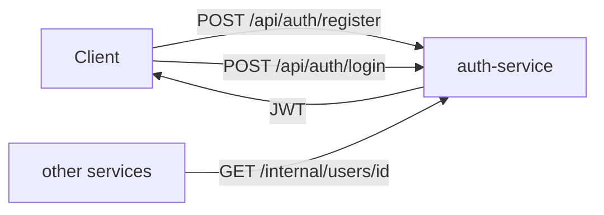

# APIs (Swagger) in TenantHub

Each service that owns a public REST API ships its own Swagger UI, generated
live from its actual running code (`springdoc-openapi`) — not a hand-written
doc that can drift out of sync. 4 of the 7 services have one.

| Service | Swagger UI | Auth on endpoints? |
|---|---|---|
| auth-service | http://localhost:8081/swagger-ui/index.html | No — it *issues* the tokens everyone else checks |
| tenant-service | http://localhost:8082/swagger-ui/index.html | No — tenant signup has to be reachable before a user exists |
| project-service | http://localhost:8083/swagger-ui/index.html | Yes — bearer JWT required |
| billing-service | http://localhost:8085/swagger-ui/index.html | Yes — bearer JWT required |

`notification-service` and `gateway-service` don't have Swagger UI and don't
need it: notification-service has no meaningful public API (just a Kafka
listener and one internal server-to-server endpoint), and gateway-service is
a router, not an API owner — it forwards to the services above rather than
exposing its own resources.

## auth-service

Two public endpoints (`register`, `login`) plus one internal-only endpoint
(`/internal/users/{id}`) — used by notification-service to resolve a task
assignee's email, never exposed through the gateway.

## tenant-service

`GET /api/plans` and `POST /api/tenants/signup` are both intentionally public
— there's no authenticated user yet at the point a new tenant is being
created. `GET /api/tenants/{id}` exists too but isn't shown expanded here.

## project-service

Every endpoint here shows a padlock icon and there's an **Authorize** button
at the top — this is the `OpenApiConfig` bearer-auth wiring (see
`project-service/src/main/java/com/tenanthub/project/config/OpenApiConfig.java`):
paste a JWT once via Authorize, and it's attached to every subsequent
"Try it out" call. `task-controller` and `project-controller` are both listed;
`comment-controller` and `me-controller` (`GET /api/me`, added this session)
exist too, just further down the page.

## billing-service

The newest addition (this session) — previously billing-service had to be
tested via raw curl through the gateway since it had no Swagger UI at all.
Same `Authorize` + padlock pattern as project-service. Just one real endpoint:
`GET /api/billing/usage`, matching how thin `UsageController` actually is.

## Why bother with per-service Swagger instead of one combined doc

Each service is independently deployable with its own JWT-secured resource
server config — a single merged API doc would either hide which service
actually owns an endpoint, or require extra tooling (a Swagger aggregator) to
build. Since every service already runs its own `/v3/api-docs`, per-service
Swagger UI is what's actually true right now, for free.
