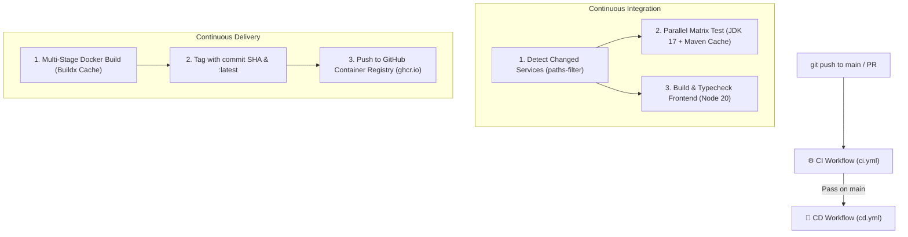
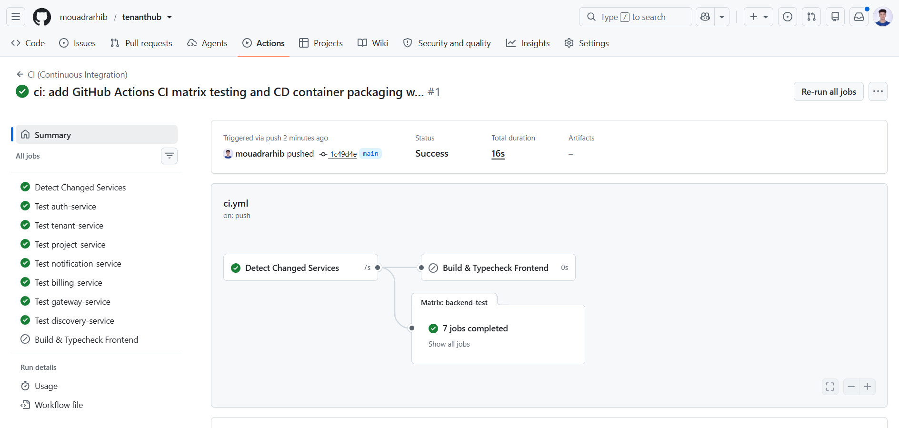
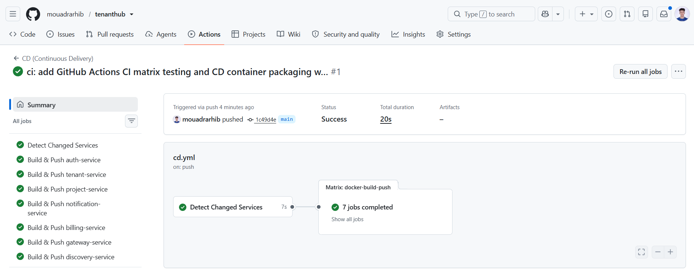
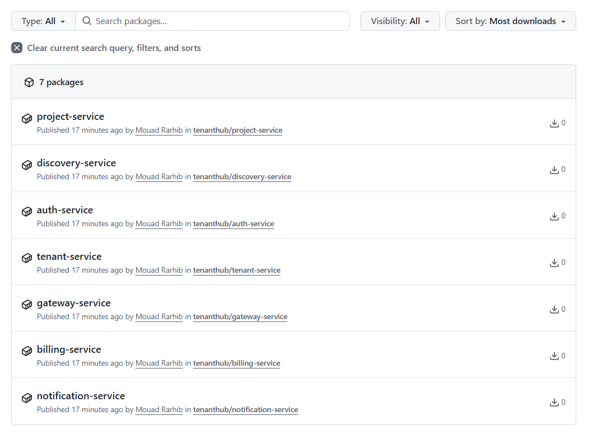

# CI/CD Pipelines in TenantHub

TenantHub uses **GitHub Actions** to automate testing, quality gates, and container delivery for all 7 Spring Boot microservices and the React frontend in this monorepo.

---

## 1. Architectural Pipeline Flow

The automation is split into two complementary workflows:

---

## 2. CI (Continuous Integration): Matrix Testing with Path Filtering

Monorepos can easily become slow if every commit rebuilds every service. `ci.yml` solves this with **path filtering** and **matrix strategy**:

* **Selective Execution**: Commits touching only `project-service/` run tests only for `project-service`.
* **Shared Contract Invalidation**: Commits touching `shared-events/` or the root `pom.xml` automatically trigger tests across all 7 services.
* **Test Isolation with Real Services**: The test runner spins up ephemeral **PostgreSQL 16** and **Redis** service containers so integration tests (`@DataJpaTest`, `@AutoConfigureTestDatabase(replace = NONE)`) validate real queries without mocks.

---

## 3. CD (Continuous Delivery): Immutable Container Packaging

Once CI passes, `cd.yml` packages the application for deployment:

* **Multi-Stage Builds**: Builds from the repository root context to resolve Maven reactor dependencies (`shared-events`) before producing lightweight JRE Alpine runtime images.
* **SHA Tagging for Rollbacks**: Every image is tagged with the unique Git commit SHA (`${{ github.sha }}`) for absolute deployment traceability, plus a convenience `:latest` tag.
* **GitHub Actions Layer Caching**: Uses `cache-from: type=gha` to ensure unchanged dependency layers are reused instantly across runs.
* **Automated GHCR Publishing**: Automatically authenticates via `GITHUB_TOKEN` and publishes images directly to GitHub Container Registry.

---

## 4. Container Registry (GHCR): Published Packages

All 7 microservices are built and stored as immutable container packages under GitHub Container Registry (`ghcr.io/mouadrarhib/tenanthub-*`):

---

## 5. Workflow Specifications

| Workflow | File | Triggers | Key Responsibilities |
|---|---|---|---|
| **CI** | [`.github/workflows/ci.yml`](../.github/workflows/ci.yml) | `push`, `pull_request`, `workflow_dispatch` | Monorepo path detection, Maven test matrix (Postgres + Redis), frontend Vite typecheck. |
| **CD** | [`.github/workflows/cd.yml`](../.github/workflows/cd.yml) | `push` on `main`, `workflow_dispatch` | Docker Buildx multi-stage packaging, SHA tagging, GHCR registry push. |
