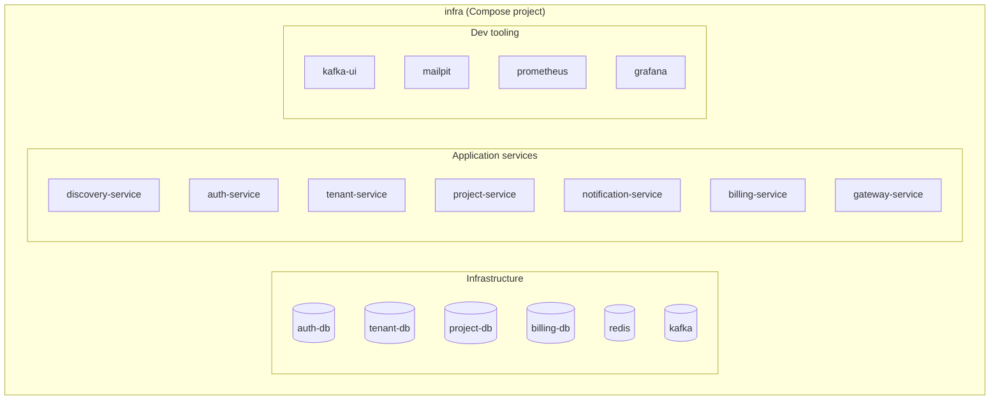
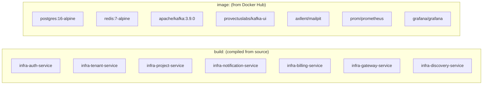
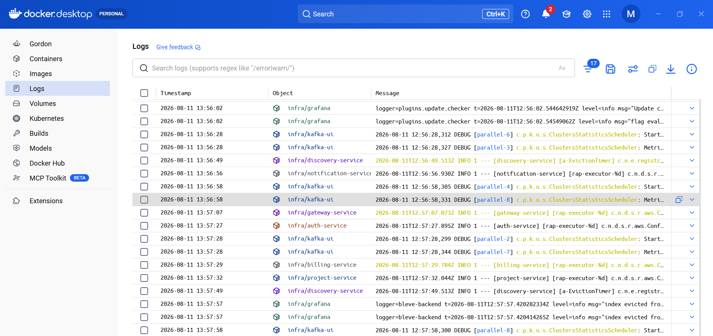
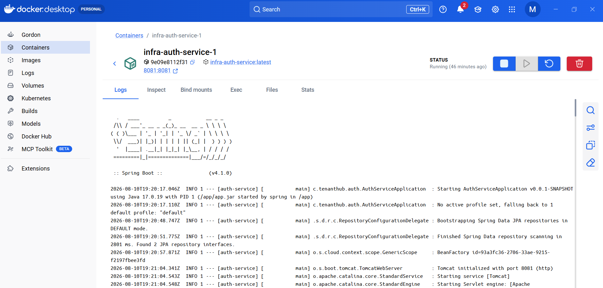
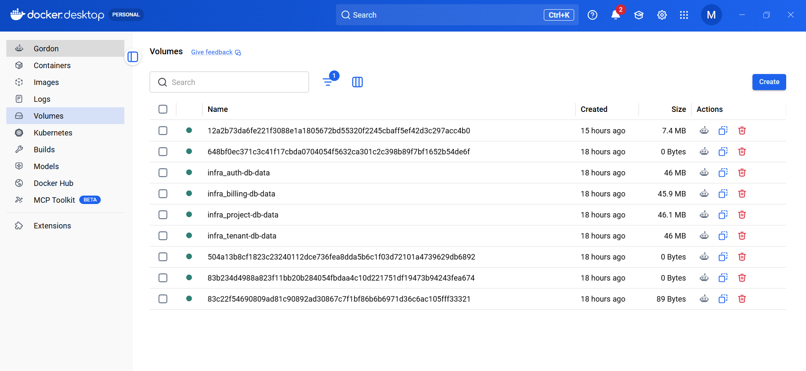

# Docker in TenantHub

Docker (via Compose) is what actually runs this entire multi-service stack
locally: 7 Spring Boot services, 4 Postgres databases, Kafka, Redis, and every
dev tool documented elsewhere in `docs/` (Kafka UI, Mailpit, Prometheus,
Grafana) — 17 containers total, defined in one file:
`infra/docker-compose.yml`.

## "infra" is the whole stack, not one thing

Docker Compose names its project after the folder the compose file lives in.
Since it's at `infra/docker-compose.yml`, Docker Desktop groups every
container it creates under one card called **"infra"** — that's not a
separate concept from Compose, it's just Desktop's view of it.

Expanding that group in **Containers** shows every one of the 17 at once —
name, image, port mapping, live CPU/memory:

## Two kinds of images: built vs pulled

`docker-compose.yml` mixes two sources per service:

The 7 `tenanthub/*` services are built from each module's own `Dockerfile`
(Maven multi-stage build, see any `*-service/Dockerfile`) — that's why
rebuilding one after a code change (`docker compose build project-service`)
is a separate step from restarting it. Everything else — databases, Kafka,
Redis, and every dev tool — is a stock image pulled straight from a registry,
no build step involved.

## Startup order is enforced by `depends_on`, not by luck

Every app service's `depends_on` block waits on its real dependencies —
`condition: service_healthy` for databases (so a service never starts
migrations against a Postgres that isn't ready yet), `condition:
service_started` for things like Kafka and discovery-service. This is why
clicking ▶ on the whole **"infra"** group in Docker Desktop reliably brings
everything up in the right order — Compose reads the same `depends_on` graph
whether it's driven from the terminal or the Desktop GUI. Starting individual
containers one at a time bypasses this entirely.

## One unified log stream across every container

Docker Desktop's **Logs** view merges every container's stdout into one
searchable, filterable stream — useful for watching a request travel through
several services at once without switching tabs:

Or drill into a single container's own **Logs** tab for just that service —
here, `auth-service` booting: Spring Boot banner, JPA repository scan, Tomcat
starting on 8081:

The same container detail page also has **Inspect** (full container/network
config), **Bind mounts**, **Exec** (shell into the running container), and
**Stats** (live CPU/memory graphs) — all reachable from the tabs shown at the
top of that view.

## Where the data actually lives: named volumes

The 4 Postgres services each mount a named volume
(`auth-db-data`, `tenant-db-data`, `project-db-data`, `billing-db-data`) —
this is *why* data survives a container restart or rebuild. When we rebuilt
and restarted `billing-service`/`project-service`/`tenant-service` earlier in
this session, none of their data was lost, because the volume — not the
container — is what actually holds it. A container is disposable; the volume
isn't:

Deleting a container (`docker compose down`, no `-v`) leaves these volumes
untouched. Only `docker compose down -v` — or deleting a volume directly here
— destroys the underlying data. `kafka` has no such volume defined in
`docker-compose.yml`, by the same design choice noted in the equivalent k8s
manifest (`infra/k8s/15-kafka.yaml`): "topic data is ephemeral, fine for a
demo cluster" — so restarting the `kafka` container clears every topic.
