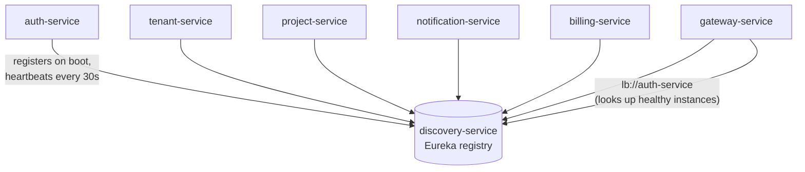
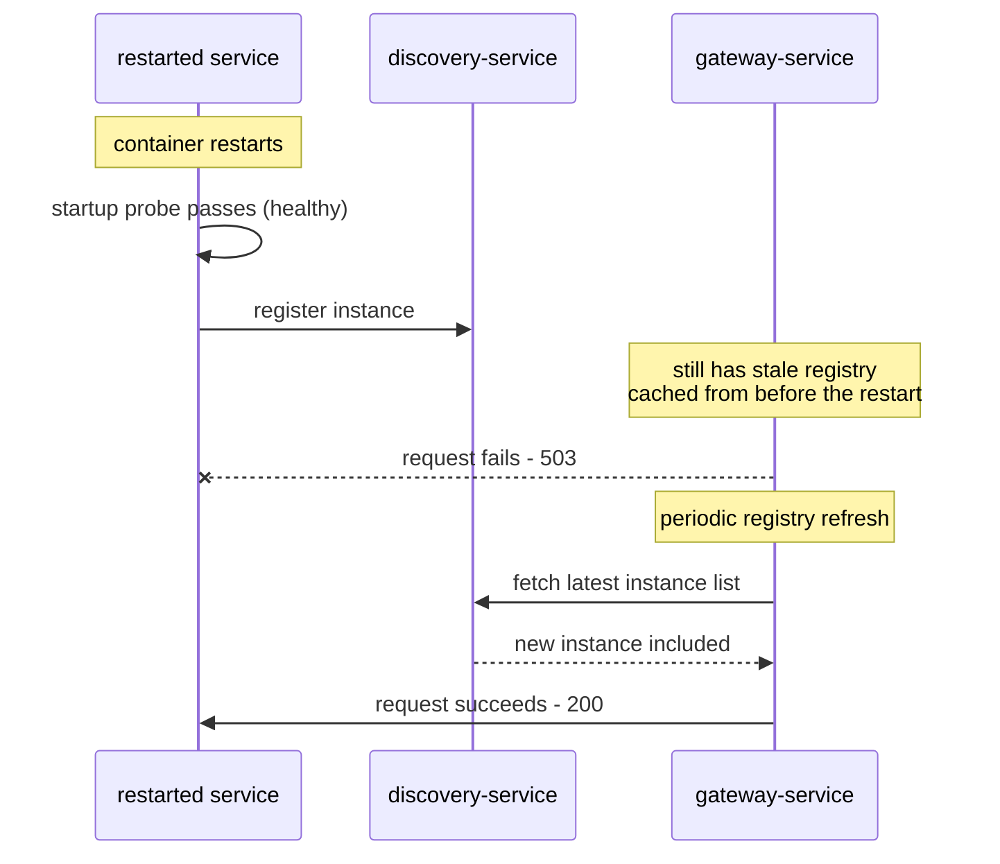

# Eureka in TenantHub

`discovery-service` runs Netflix Eureka — the service registry every other
service registers itself with on startup, and the thing `gateway-service`
(via `lb://service-name` routes) and every internal service-to-service call
actually looks up instead of a hardcoded host:port.

- **Dashboard**: http://localhost:8761

## What the dashboard actually shows

All 6 app services registered and `UP`, one instance each — matches this
being a local Compose stack (the k8s manifests run 2 replicas for some
services, where you'd see two entries under the same `APPLICATION` name
instead). `discovery-service` itself doesn't register with itself, so it's
not in this list.

Each instance id is `<container-id>:<service-name>:<port>` — e.g.
`9e09e8112f31:auth-service:8081` — the container id prefix is there so
multiple replicas of the same service never collide on the same instance id.

### The numbers that matter

| Field | Value | Meaning |
|---|---|---|
| Lease expiration enabled | `true` | Eureka will actively evict instances that stop heartbeating |
| Renews threshold | 11 | Expected heartbeats/minute across all registered instances, computed from how many are registered |
| Renews (last min) | 24 | Actual heartbeats received — comfortably above threshold, so self-preservation mode isn't kicking in |

If "Renews (last min)" ever drops well below the threshold (e.g. several
services crash-looping at once), Eureka's **self-preservation mode** kicks in
and it stops evicting instances — on the theory that a sudden mass renewal
drop is more likely a network partition than every instance actually being
dead. That's a safety net against a monitoring blind spot wiping the whole
registry over a blip.

## Why this explains the `503`s we kept hitting this session

Every time we rebuilt and restarted `project-service`, `gateway-service`, or
`billing-service` earlier and immediately hit the gateway, we got a `503`
before things settled. This dashboard is the direct explanation why: a
restarted service has to (1) boot, pass its own health checks, (2)
**register with Eureka**, and (3) wait for `gateway-service`'s own client-side
registry cache to refresh (it doesn't query Eureka on every single request).
Until step 3 finishes, the gateway still thinks the old, now-dead instance is
the only one available — hence the transient `503`.

This is exactly what `docs/prometheus-grafana.md`'s Error Rate spike captured
happening live — Eureka's registry state is the missing piece that explains
*why* it happened, not just *that* it happened.
