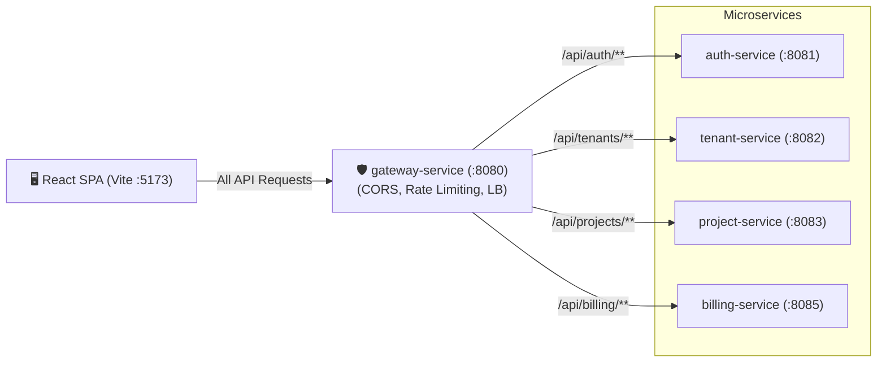
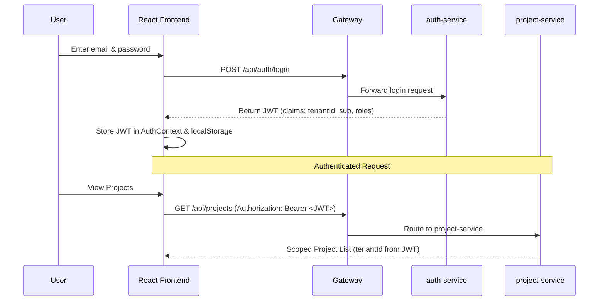

# Frontend in TenantHub

The TenantHub frontend is a lightweight **React 18 + TypeScript** application built with **Vite** and styled with **Tailwind CSS**. It is designed as a focused, thin client that interacts exclusively with the backend microservices through the **API Gateway**.

---

## 1. Architectural Role & Flow

The frontend does not communicate with backend services directly. Every request is routed through `gateway-service:8080`, which handles routing, load balancing via Eureka, rate limiting, and CORS headers.



---

## 2. Authentication & Tenant Context

1. **Sign Up & Login**:
   - Users register with `POST /api/auth/register` (specifying their `tenantId`, email, and password) or log in via `POST /api/auth/login`.
   - The response returns a signed **JWT** containing the user's ID (`sub`), `tenantId`, and `roles`.
2. **Session Storage & Request Injection**:
   - The token is managed via a single React `AuthContext` and stored in `localStorage`.
   - The central API fetch client (`api/client.ts`) attaches `Authorization: Bearer <token>` to every subsequent HTTP request.
3. **Tenant Isolation**:
   - The browser never passes `tenantId` in URL paths or request bodies for resources; backend services extract it securely from the validated JWT claims.



---

## 3. Core Components

The UI is intentionally structured into modular components:

| Component | File | Responsibilities |
|---|---|---|
| **`App`** | `src/App.tsx` | Root component branching on `isAuthenticated` (renders Login/Register or Dashboard). |
| **`LoginForm`** | `src/components/LoginForm.tsx` | Handles email/password submission, error alerts, and demo credential pre-fill. |
| **`RegisterForm`** | `src/components/RegisterForm.tsx` | Registers a new user under a specific `tenantId`. |
| **`Dashboard`** | `src/components/Dashboard.tsx` | Main workspace layout: project selector, task list, creation form, and usage tracker. |
| **`TaskList`** | `src/components/TaskList.tsx` | Renders tasks filtered by the selected project, showing status, priority, and assignees. |
| **`CreateTaskForm`** | `src/components/CreateTaskForm.tsx` | Task creation form with a 1-click **"Assign to me"** shortcut. |
| **`UsageWidget`** | `src/components/UsageWidget.tsx` | Live plan limits and usage progress bar fetched from `billing-service`. |

---

## 4. Live Billing & Plan Usage Widget

The **`UsageWidget`** connects the asynchronous Kafka pipeline to the frontend:

1. When projects are created, `project-service` emits `project.created` over Kafka.
2. `billing-service` consumes the event and increments `projects_count` in its database.
3. The frontend calls `GET /api/billing/usage`:
   ```json
   {
     "planName": "Pro",
     "maxProjects": 20,
     "projectsUsed": 3,
     "maxUsers": 10
   }
   ```
4. The widget displays a real-time progress bar (`3 / 20 Projects`) and highlights in red if the tenant approaches or hits plan limits.

---

## 5. Gateway CORS Configuration

Because the frontend runs on `http://localhost:5173` and the backend services run on distinct ports (`8081`–`8085`), Cross-Origin Resource Sharing (CORS) is configured **once** at the Gateway level (`gateway-service/src/main/resources/application.yml`):

```yaml
spring:
  cloud:
    gateway:
      server:
        webflux:
          globalcors:
            cors-configurations:
              '[/**]':
                allowed-origins: 'http://localhost:5173'
                allowed-methods: ['GET', 'POST', 'PUT', 'DELETE', 'OPTIONS']
                allowed-headers: ['Authorization', 'Content-Type']
```

This prevents duplicate CORS configuration across individual microservices.

---

## 6. Running Locally

```bash
cd frontend
npm install
npm run dev
```

The application will be available at `http://localhost:5173`.
