# Kafka & Mailpit in TenantHub

Kafka is the async event bus connecting services that shouldn't know about each
other directly. Mailpit is where the *result* of one of those event chains — a
task-assignment email — actually lands in local/dev environments, without
sending real mail anywhere.

## Kafka — decoupling services with events

Three services publish events; two other services consume them. Nobody calls
anybody's REST API for this — it's all one-way, fire-and-forget messages through
Kafka.

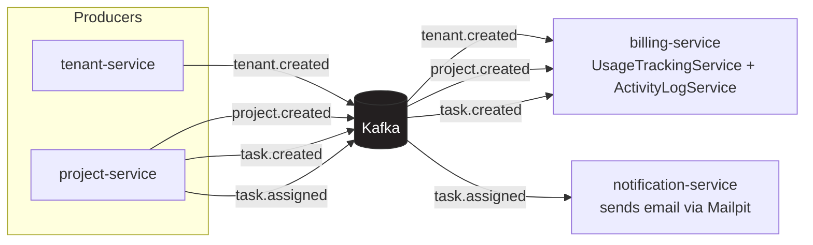

| Topic | Producer | Consumer | What happens |
|---|---|---|---|
| `tenant.created` | tenant-service | billing-service | Records tenant usage against its plan |
| `project.created` | project-service | billing-service | Increments `projects_count` usage |
| `task.created` | project-service | billing-service | Logged to `ActivityLog` for tenant-scoped audit trail |
| `task.assigned` | project-service | notification-service | Looks up the assignee's email via auth-service, sends the notification |

This is why billing-service never has to know project-service exists, and
project-service never has to know an email even gets sent — each side only
knows about the event, not the other service.

### Kafka UI: cluster overview

One broker, one cluster (`tenanthub`), 54 partitions across 5 topics
(4 business topics + the internal `__consumer_offsets`):

### Topics list

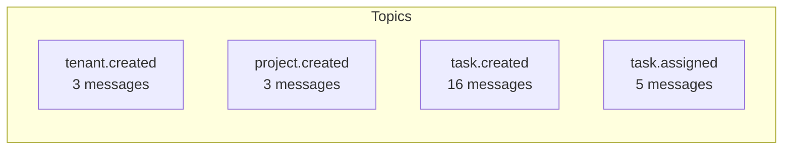

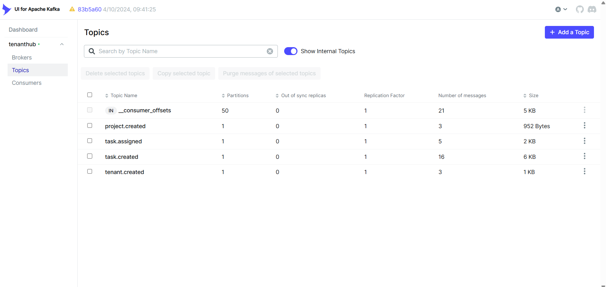

### Inspecting real messages

`project.created` — each message keyed by the project's own id, value is the
full `ProjectCreatedEvent` JSON:

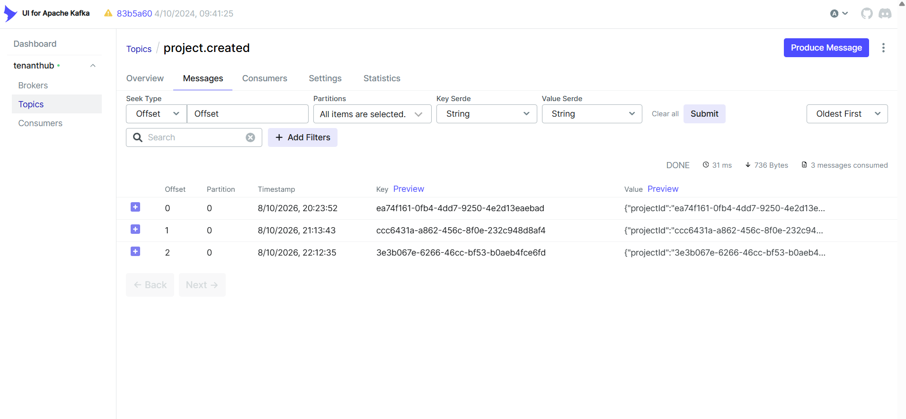

`task.assigned` — same pattern, keyed by `taskId`:

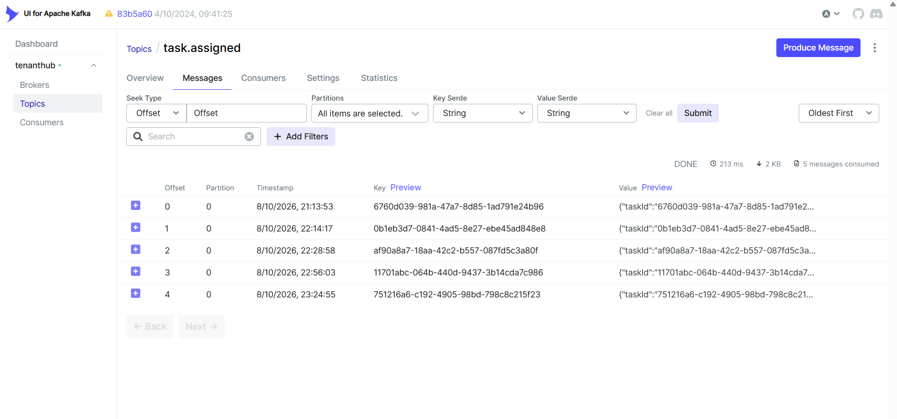

### Consumer groups

Confirms who's actually listening: `billing-service` is subscribed to 2 topics
here (`tenant.created` + `project.created` — taken before `task.created` had a
consumer), `notification-service` to 1 (`task.assigned`) — both `STABLE`,
meaning they're connected and healthy, no rebalancing in progress:

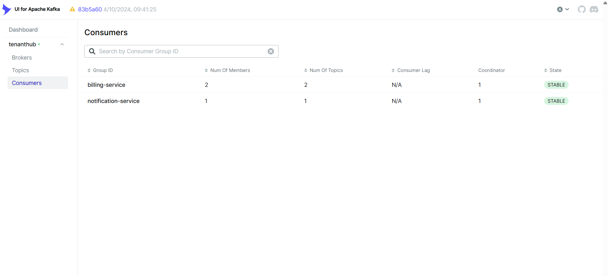

### billing-service consumer group detail

After adding `TaskEventListener`, drilling into the `billing-service` group
shows 3 members — one per `@KafkaListener` method (`TenantEventListener`,
`ProjectEventListener`, `TaskEventListener`) — each assigned its own
partition, `STABLE`, and zero total lag across all three topics
(`tenant.created`, `project.created`, `task.created`), confirming
`task.created` is now being consumed alongside the other two, not just
published into the void:

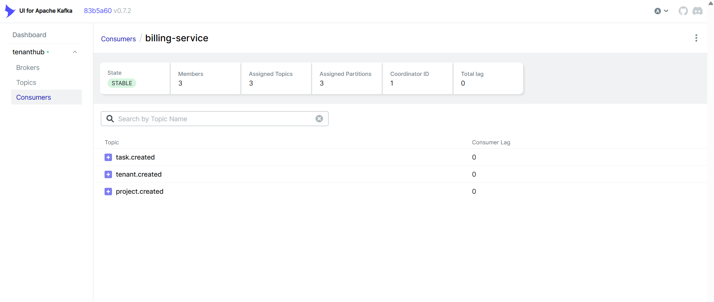

### Failure handling: Dead Letter Topics

Every listener in billing-service shares one `DefaultErrorHandler` bean
(`KafkaErrorHandlingConfig`) wired with a `DeadLetterPublishingRecoverer` and a
`FixedBackOff(1000L, 2L)` — 1 initial attempt + 2 retries, 1 second apart (3
attempts total). If all three fail, the recoverer republishes the original
record to a dead letter topic instead of retrying forever or dropping it
silently.

That DLT is named `<topic>-dlt` (Spring Kafka's default suffix) — for
`task.created`, that's **`task.created-dlt`**, confirmed below by forcing
`TaskEventListener` to throw on a test event and watching it land there. Value
is the untouched original `TaskCreatedEvent` JSON, keyed by `taskId`:

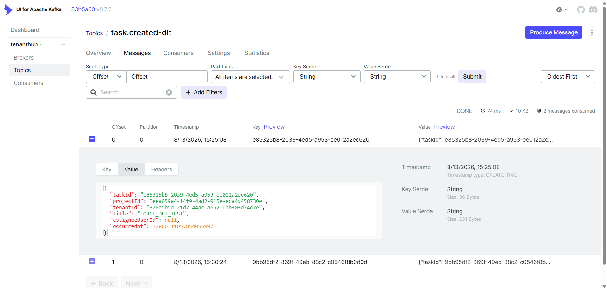

### Broker config

The single KRaft broker's runtime config (default values, single-node demo
setup — no replication, no Zookeeper):

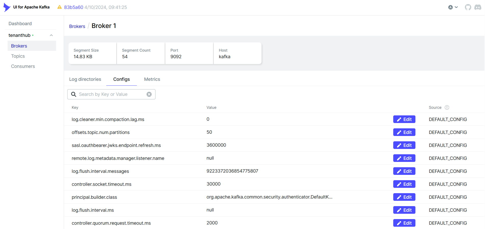

## Observability: broker metrics and real consumer lag

Two separate exporters feed Prometheus, because neither one alone can see the
whole picture:

- **`jmx_prometheus_javaagent`**, attached to the `kafka` container via
  `KAFKA_OPTS` (port `7071`) — broker-side throughput (`MessagesInPerSec`,
  `BytesInPerSec`/`BytesOutPerSec` per topic). It reads whatever JMX MBeans the
  broker itself publishes, which does **not** include per-consumer-group lag -
  that's not a broker-side JMX metric at all.
- **`kafka-lag-exporter`** (`seglo/kafka-lag-exporter`, port `8000`) — talks
  the Kafka protocol directly via the Admin API to compute real lag per
  consumer group/topic/partition. `group-whitelist = [".*"]` in
  `infra/kafka-lag-exporter/application.conf` watches every group
  automatically, so both `billing-service` and `notification-service` show up
  with no group hardcoded anywhere.

Both are added to `infra/prometheus.yml` as their own scrape jobs
(`kafka-broker`, `kafka-lag-exporter`), separate from the 7 Spring Boot
services' job.

### Watching real lag rise and fall

`kafka_consumergroup_group_sum_lag`, graphed in Prometheus, from an actual
test: `billing-service` stopped, 4 tasks published while it was down (the lag
spike to 4), then restarted and caught up (drop to 0) - repeated a second time
with 1 task for a smaller spike. `notification-service` stays flat at 0 the
whole time since it was never touched:

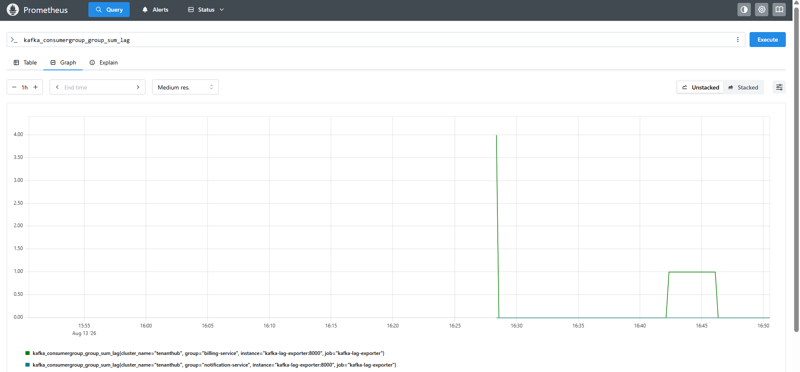

## Mailpit — where task-assignment emails land

`notification-service` sends real SMTP messages via `JavaMailSender` — the only
thing that's different in dev is *where* they go. Instead of a real mail
provider, `SPRING_MAIL_HOST`/`SPRING_MAIL_PORT` point at Mailpit, a fake SMTP
server that catches every email instead of delivering it anywhere.

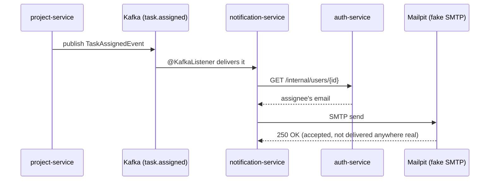

### Inbox

Every task-assignment email shows up here instantly — nothing ever leaves the
machine:

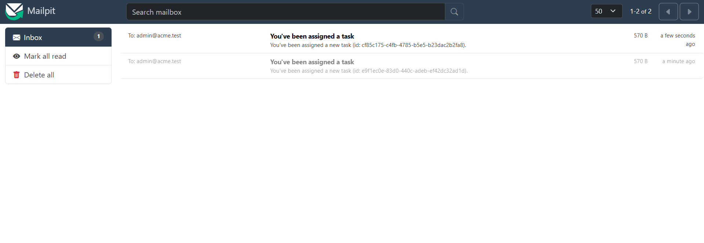

### Message content

Click into one to see the full rendered email — subject, body, headers, and
the `Return-Path` (`spring@<container-id>`, since it's the JVM's own hostname,
not a real domain):

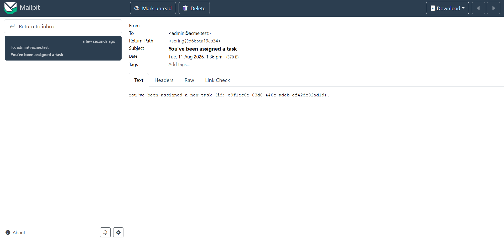

## Why these two exist together in one doc

They're two ends of the same flow: **Kafka carries the event that says a task
was assigned; Mailpit is where the side effect of that event (the email)
becomes visible.** Watching a message land in `task.assigned` in Kafka UI and
then immediately seeing the matching email appear in Mailpit's inbox is the
fastest way to confirm the whole async chain — publish → consume → external
call → send — actually works end to end.
