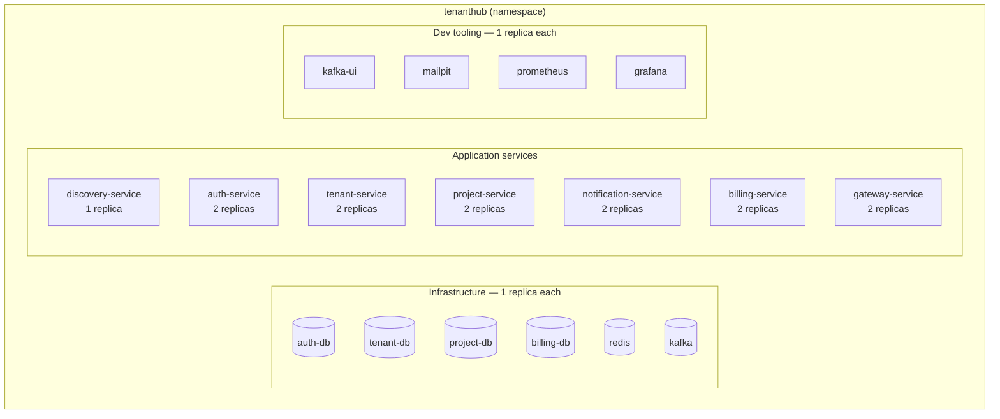
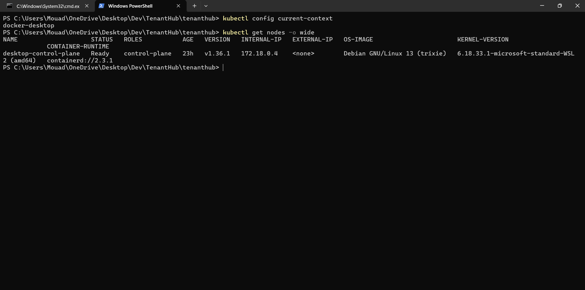
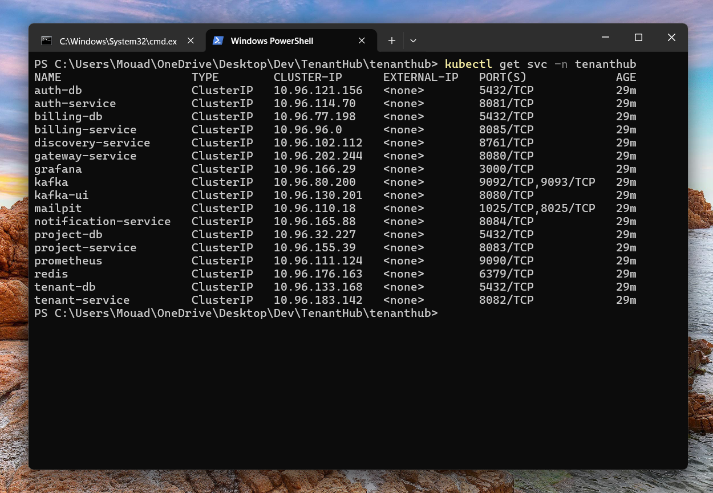
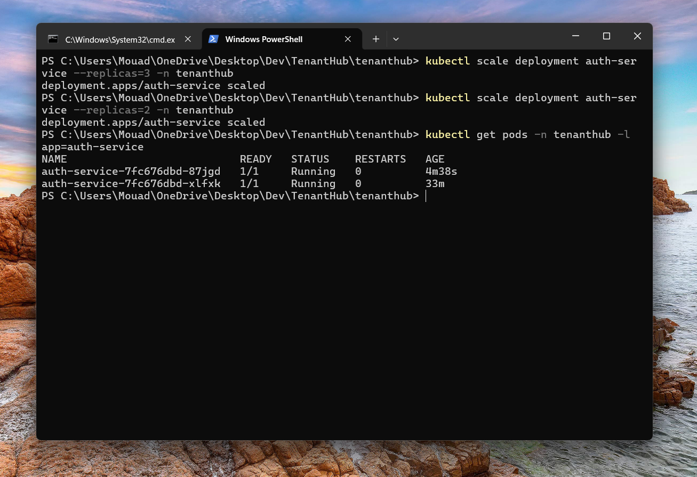

# Kubernetes in TenantHub

Everything Docker Compose runs in `infra/docker-compose.yml` has an equivalent
Kubernetes manifest set in `infra/k8s/` — 21 YAML files, applied as one
`tenanthub` namespace, deployable to any local cluster (this was run against
Docker Desktop's built-in Kubernetes). Same 7 Spring Boot services, same 4
Postgres databases, same Kafka/Redis/dev-tooling — but running as Deployments
and Services instead of Compose containers, with the scaling and self-healing
that actually comes with that.



The 6 app services (everything except `discovery-service`) run 2 replicas
each — real horizontal scaling, load-balanced by their `Service` object.
Databases, Kafka, and `discovery-service` are single-instance by design: this
is a demo-scale, non-clustered setup (Eureka here doesn't peer with other
instances, and Kafka runs single-broker KRaft mode with no PVC — topic data is
ephemeral, same trade-off noted in `infra/k8s/15-kafka.yaml`).

## The manifests are numbered for a reason

Filenames (`00-namespace.yaml`, `01-configmap.yaml`, … `34-mailpit.yaml`)
encode apply order: namespace and config first, then databases/infra, then
`discovery-service` before any service that registers with it, then the rest.
`kubectl apply -f infra/k8s/` reads a directory alphabetically, so the numbers
alone are enough to apply everything correctly in one command — no need to
apply files one at a time.

`kubectl apply` doesn't wait for one resource to become healthy before
creating the next, though. A service can briefly try to boot before its
database is accepting connections yet — that's fine, Kubernetes' restart
policy retries automatically until it succeeds.

## Cluster setup

```
kubectl config current-context   # docker-desktop
kubectl get nodes -o wide
```



Docker Desktop's Kubernetes here runs as a single `kind`-style node
(`desktop-control-plane`) on `containerd`, not the classic Docker-engine CRI —
worth knowing because it changes how locally built images reach the cluster
(see below).

## Local images: the one gotcha that isn't obvious

`docker compose build` names images `infra-<service>` (Compose prefixes with
the project folder name). The very first time these manifests were applied,
every app service came up `ImagePullBackOff` — the YAMLs originally referenced
a different name, and Kubernetes tried pulling it from Docker Hub instead of
using the image already built locally. The fix was just correcting each
`image:` field to match what `docker images` actually shows
(`infra-auth-service:latest`, etc.) with `imagePullPolicy: IfNotPresent`
already in place.

Docker Desktop's containerd registry mirror
(`docker/desktop-containerd-registry-mirror`) is what makes this work without
an extra `kind load docker-image` step — locally built images are picked up
automatically once the name matches.

## Pod health

```
kubectl get pods -n tenanthub
```


Every pod `1/1 Running`, `0` restarts — 4 databases, `redis`, `kafka`,
`discovery-service`, 6 app services (2 pods each), and the dev-tooling
(`grafana`, `prometheus`, `kafka-ui`, `mailpit`), all in the `tenanthub`
namespace.

Getting here took a second fix beyond the image names: `kafka-ui` kept
crash-looping because its readiness/liveness probes started checking before
the JVM had finished booting, with no grace period. Adding a `startupProbe`
(30 attempts × 5s, matching the pattern already used in
`20-discovery-service.yaml` and every app service) gates the other two probes
until the app has actually started once — the same JVM-cold-start problem
Compose doesn't have to deal with, since `depends_on: condition:
service_healthy` isn't a Kubernetes concept.

## Services: how pods find each other

```
kubectl get svc -n tenanthub
```



Every entry is `ClusterIP` with `EXTERNAL-IP: <none>` — internal-only,
reachable by other pods via DNS (`http://auth-service:8081`) but not from
outside the cluster. That `CLUSTER-IP` column (`10.96.x.x`) is a virtual IP
that only exists inside the cluster's internal network — not the host
machine's real address, safe to publish anywhere. The one thing meant to be
externally reachable, `gateway-service`, is exposed through
`30-ingress.yaml` instead of a `LoadBalancer`/`NodePort` service (routes
`tenanthub.local` → `gateway-service:8080`, and needs an ingress controller
like ingress-nginx installed in the cluster to actually work).

## Scaling: `replicas` isn't just a number in a file

```
kubectl scale deployment auth-service --replicas=3 -n tenanthub
kubectl scale deployment auth-service --replicas=2 -n tenanthub
kubectl get pods -n tenanthub -l app=auth-service
```



`21-auth-service.yaml` declares `replicas: 2`; `kubectl scale` changes the
live count without touching the file — useful for a quick load test, but the
committed manifest is still the source of truth, so scaling back down after
matters if you want `kubectl apply` to stay a no-op. `-l app=auth-service`
filters `get pods` down to just this Deployment's pods by label, out of the
20+ pods in the namespace.

## Self-healing: the actual point of using Kubernetes over Compose

```
kubectl delete pod auth-service-7fc676dbd-pvrpf -n tenanthub
kubectl get pods -n tenanthub -l app=auth-service
```


Deleting a pod directly doesn't remove it from the Deployment — the
Deployment's controller notices the replica count dropped below what
`21-auth-service.yaml` declares and immediately schedules a replacement
(`qml64` here), independent of anything a human does. First check after the
delete shows it `0/1 Running` — still booting, registering with Eureka,
passing its `startupProbe` — the second check, once its `AGE` reaches `10m`,
shows it `1/1`. Compose has no equivalent of this: a killed container just
stays dead until someone restarts it manually.
