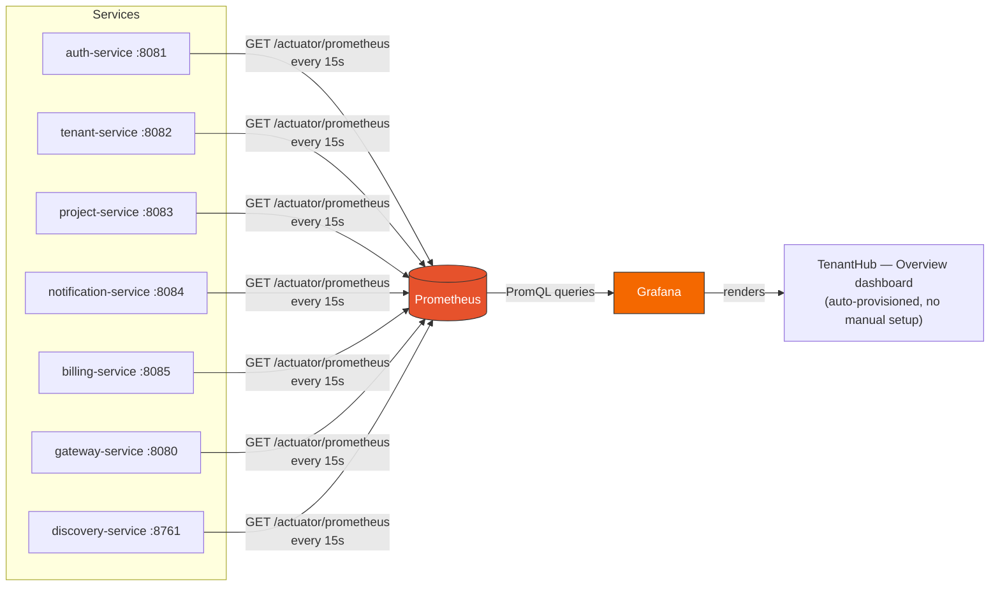
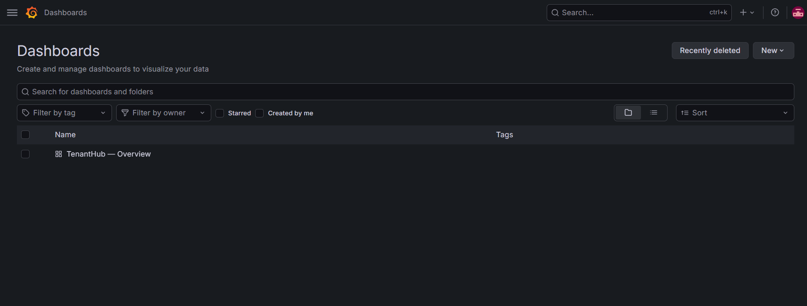
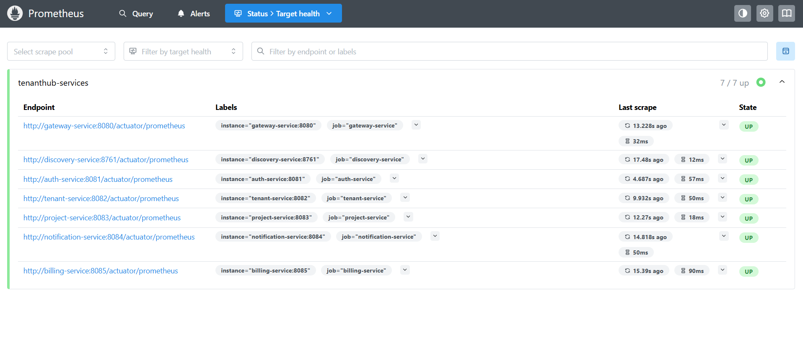
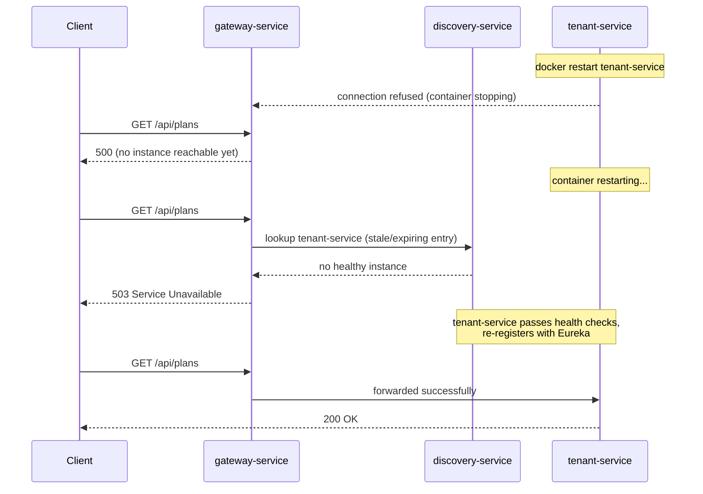

# Prometheus & Grafana in TenantHub

Prometheus collects metrics from every service; Grafana turns them into the
dashboard you actually look at. Neither holds business data — this is purely
operational visibility (request rates, error rates) layered on top of the same
7 services everything else in this doc set exercises.

## How metrics get from a service to the dashboard

Every Spring Boot service exposes `/actuator/prometheus` via Micrometer
(`management.endpoints.web.exposure.include: health,prometheus` in each
service's config). Prometheus scrapes all 7 on a 15s interval and stores the
time series; Grafana never talks to the services directly, only to Prometheus.

The dashboard itself is **provisioned automatically** — a datasource pointing
at Prometheus and the dashboard JSON are mounted into the Grafana container on
startup (`infra/grafana/provisioning/`), so it's already there the first time
you log in, no manual "add data source" / "import dashboard" clicking:

## Confirming Prometheus can actually reach every service

**Status → Target health** shows the live scrape status per service — `7/7 up`,
with per-target scrape latency (12–90ms) and how long ago each was last
scraped:

## The Dashboards

### 1. TenantHub — Overview (RED Method)

Three panels implementing the industry-standard **RED Method** (**R**ate, **E**rror, **D**uration/Latency), grouped by service (`job` label):

- **Request Rate (Rate)** — `sum by (job) (rate(http_server_requests_seconds_count[1m]))`
- **Error Rate (Errors)** — same query filtered to `status=~"5.."` (5xx only)
- **Average Latency (Duration)** — `sum by (job) (rate(http_server_requests_seconds_sum[1m])) / sum by (job) (rate(http_server_requests_seconds_count[1m]))`

### 2. TenantHub — Kafka

Provides broker throughput and real-time per-consumer-group/topic lag metrics (detailed in [`docs/kafka-mailpit.md`](kafka-mailpit.md)).

The Error Rate spike below is exactly that sequence, captured live: restarting
`tenant-service` and hammering `GET /api/plans` through the gateway during the
outage produced genuine `500`s (while the container was down) then `503`s
(once Eureka noticed the instance was gone but hadn't registered the new one
yet), tapering back to zero once `tenant-service` finished restarting and
re-registered:

Note the **Request Rate** panel (left) stays busy the whole time — the gateway
was still accepting and routing traffic — while **Error Rate** (right) is the
signal that something was actually failing underneath. This is the whole
point of separating the two panels: request volume alone doesn't tell you
whether requests are succeeding.

## Why this matters beyond a demo

This is the same failure mode we hit accidentally earlier in this session,
twice — restarting `billing-service` and `project-service` after rebuilding
their images, then getting a `503` on the very next request because Eureka
hadn't propagated the new instance yet. At the time we diagnosed it by reading
container logs and retrying by hand. With Prometheus/Grafana running, that
exact failure now shows up as a visible spike on a dashboard instead of
something you have to notice manually.
