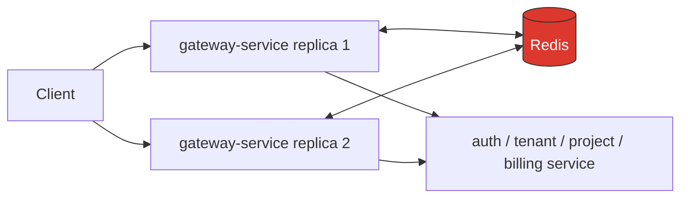
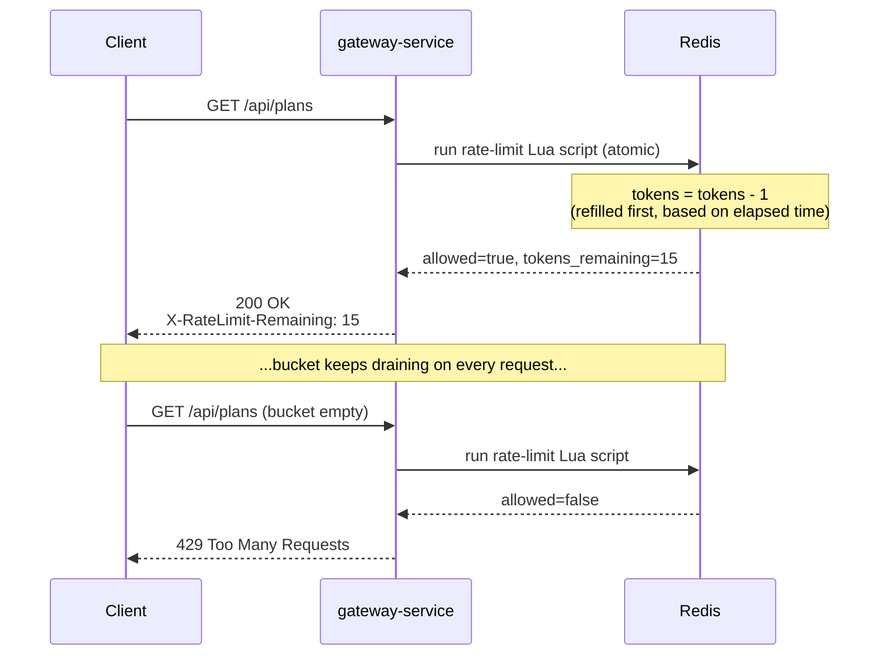
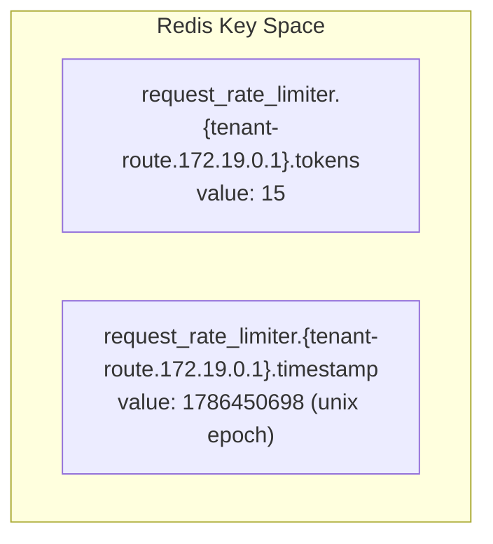

# Redis in TenantHub

Redis has exactly **one job** in this system: it's the shared counter store behind
the API gateway's rate limiter. It holds no business data, no user records, no
sessions — nothing else in the stack talks to it.

## Why a rate limiter needs a shared store at all

`gateway-service` runs multiple replicas (2 in `infra/k8s/26-gateway-service.yaml`).
The rate limit ("max 10 req/s, burst up to 20, per client IP, per route") only
holds up if every replica is checking and updating the **same** counters. If each
replica tracked usage in its own memory, a client could dodge the limit simply by
landing on a different replica each time.

Redis is the one shared place both replicas read from and write to, so the limit
is enforced consistently no matter which replica handles a given request.



Without Redis, replica 1 and replica 2 would each think the client has used
"3 of 20" independently — the client would effectively get double the allowed
rate by alternating between replicas.

## The algorithm: token bucket

Each client starts with a full bucket of tokens (`burstCapacity`). Every request
costs 1 token. Tokens refill continuously at `replenishRate` tokens/second. If the
bucket is empty, the request is rejected (`429 Too Many Requests`) until it refills.



This is configured per route in `gateway-service/src/main/resources/application.yml`:

```yaml
filters:
  - name: RequestRateLimiter
    args:
      redis-rate-limiter.replenishRate: 10   # tokens added per second
      redis-rate-limiter.burstCapacity: 20    # bucket size / max burst
      redis-rate-limiter.requestedTokens: 1   # cost per request
      key-resolver: "#{@ipKeyResolver}"       # one bucket per client IP
```

Every route (`auth-route`, `tenant-route`, `project-route`, `billing-route`) has
its **own independent bucket per client IP** — hammering `/api/projects/**`
doesn't touch your budget on `/api/tenants/**`.

## What's actually stored in Redis

Two keys per `{route, client IP}` pair:



| Key suffix | Meaning |
|---|---|
| `.tokens` | Tokens remaining in this client's bucket for this route |
| `.timestamp` | Last time the bucket was refilled, used to compute how many tokens to add on the next request |

Both keys carry a short TTL (a few seconds) — Spring Cloud Gateway's rate-limiter
script sets it so idle clients' counters expire and clean themselves up instead of
accumulating forever in Redis.

## Verifying it live

```bash
# generate some traffic through the gateway
for i in $(seq 1 5); do curl -s -o /dev/null http://localhost:8080/api/plans; done

# inspect what landed in Redis
docker exec infra-redis-1 redis-cli KEYS "*"
docker exec infra-redis-1 redis-cli GET "request_rate_limiter.{tenant-route.<client-ip>}.tokens"
```

With `burstCapacity: 20` and 5 requests sent, `.tokens` should read `15` —
confirming the bucket actually drained by exactly the number of requests made.

## Why there's no UI for this (unlike Kafka UI / Mailpit)

Kafka and Mailpit hold data meant to be read by a human — business events,
emails. Redis here holds only this ephemeral rate-limiter counter state: no
business data, nothing meaningful to browse. `redis-cli` (as used above) is
enough to inspect it; a dashboard isn't warranted for two auto-expiring integers
per client.
