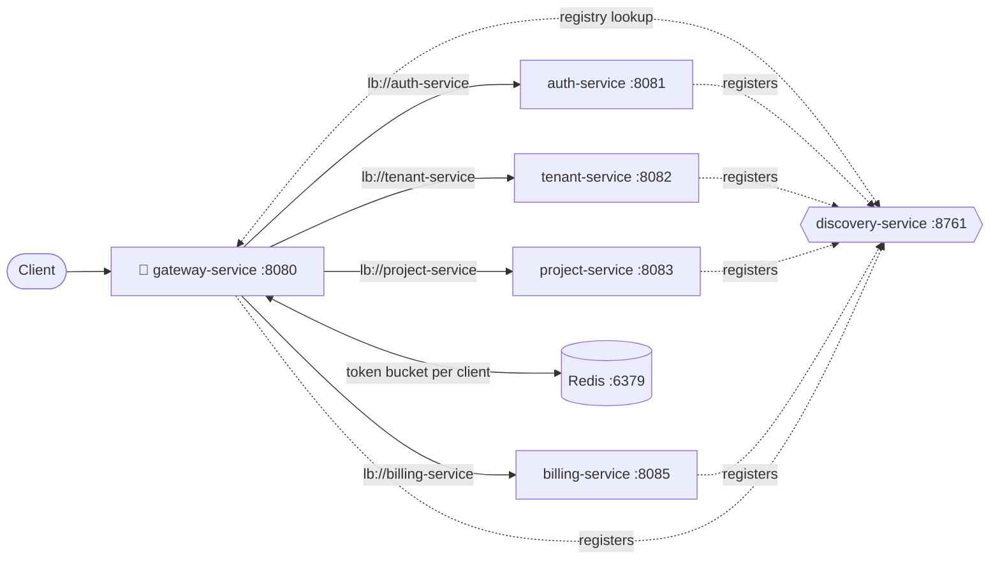
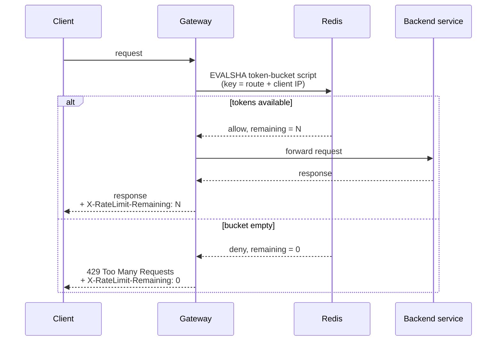

# gateway-service

The front door. Every request that enters TenantHub from outside comes through here
first — it looks up the right backend in Eureka's registry, forwards the request, and
throttles clients that call too fast. No database, no business logic of its own; it's
routing plus traffic control.

| | |
|---|---|
| Port | `8080` |
| Database | — |
| Depends on | `discovery-service` (registry), Redis (rate-limit counters), whichever backend a route points to |

## How it fits together



Two independent mechanisms, both configured here: **service discovery** (Eureka tells
the Gateway where each backend currently lives) and **rate limiting** (Redis tracks how
many requests each client has left). Neither backend service knows either of these
things is happening.

## Service discovery — how a route finds a live address

Every backend service registers itself with `discovery-service` on startup, under the
name in its own `spring.application.name`. The Gateway doesn't route to a hardcoded
`host:port` — it routes to `lb://<that-name>`, and Spring Cloud LoadBalancer resolves it
against the current registry on every request. If a service restarts on a different
port, or a second instance comes up for load balancing, no Gateway config changes.

**A real bug hit getting this working:** Eureka was registering every service under its
Windows/Hyper-V hostname (`DESKTOP-XXXX.mshome.net`), which isn't DNS-resolvable outside
that machine. Registration itself looked fine — the Eureka dashboard showed everything
`UP` — but the actual proxy call failed with `UnknownHostException` the moment the
Gateway tried to forward a request. Fixed with one property, on every client service:

```yaml
eureka:
  instance:
    prefer-ip-address: true   # register with IP, not hostname
```

## Routing

```yaml
spring:
  cloud:
    gateway:
      server:
        webflux:
          routes:
            - id: auth-route
              uri: lb://auth-service
              predicates:
                - Path=/api/auth/**
            - id: tenant-route
              uri: lb://tenant-service
              predicates:
                - Path=/api/tenants/**,/api/plans/**
            - id: project-route
              uri: lb://project-service
              predicates:
                - Path=/api/projects/**,/api/tasks/**,/api/comments/**
            - id: billing-route
              uri: lb://billing-service
              predicates:
                - Path=/api/billing/**
```

| Route | Matches | Forwards to |
|---|---|---|
| `auth-route` | `/api/auth/**` | `auth-service` |
| `tenant-route` | `/api/tenants/**`, `/api/plans/**` | `tenant-service` |
| `project-route` | `/api/projects/**`, `/api/tasks/**`, `/api/comments/**` | `project-service` |
| `billing-route` | `/api/billing/**` | `billing-service` (no controllers yet — route exists for when it does) |

**No `StripPrefix` filter, deliberately.** Every controller in this repo is already
mapped starting with `/api/...` (`@RequestMapping("/api/auth")`, `/api/projects`, etc.),
so the path the client sends and the path the controller expects are identical. Most
Gateway tutorials strip the `/api` prefix before forwarding — doing that here would send
`/projects/42` to a controller that only answers at `/api/projects/42`, a silent 404.

**A second real bug hit getting this working:** the config path above is
`spring.cloud.gateway.server.webflux.routes`, *not* the classic
`spring.cloud.gateway.routes` that most Spring Cloud Gateway documentation (and this
project's `spring-gateway-eureka-tutorial.html`) shows. This project's Spring Cloud
version (`2025.1.2`) ships Gateway as a split `-server-webflux` / `-server-webmvc`
artifact pair rather than one `spring-cloud-starter-gateway`, and the reactive one's
`@ConfigurationProperties` prefix moved along with it. Under the old prefix, routes
bound to a silently empty list (`New routes count: 0` in the logs) — no error, no
warning, every request just 404'd as if no route existed.

**No JWT verification at the Gateway.** Each backend service already verifies the JWT
itself (see `auth-service/README.md` for the full sign/verify flow) — `project-service`
has its own `JwtDecoder` and reads `tenantId` straight out of the token's claims via
`TenantContext`, which is what the entire cross-tenant-isolation test suite from P3
depends on. Centralizing auth at the Gateway (verify once, forward trust headers,
services stop checking tokens themselves) is a legitimate pattern, but retrofitting it
here would mean rebuilding already-working, already-tested per-service security — out of
scope for "add a Gateway." The `Authorization` header passes through untouched; every
service still checks it exactly as before.

## Rate limiting

Redis-backed token bucket, one bucket per `(route, client IP)` pair, applied to all four
routes:

```yaml
filters:
  - name: RequestRateLimiter
    args:
      redis-rate-limiter.replenishRate: 10   # tokens added per second
      redis-rate-limiter.burstCapacity: 20   # bucket size — max burst above steady rate
      redis-rate-limiter.requestedTokens: 1  # cost per request
      key-resolver: "#{@ipKeyResolver}"
```

`ipKeyResolver` is a small bean in `config/RateLimiterConfig.java`:

```java
@Bean
public KeyResolver ipKeyResolver() {
    return exchange -> Mono.just(exchange.getRequest().getRemoteAddress().getAddress().getHostAddress());
}
```

Keyed by IP rather than tenant/user, because the JWT isn't decoded at the Gateway (see
above) — pulling a claim out of it here would mean either verifying the signature twice
(once here, once per-service) or trusting an unverified claim, neither of which is worth
it for a rate-limit key alone.



The bucket state is real Redis data, not in-memory on the Gateway — inspectable directly:

```bash
docker exec tenanthub-redis redis-cli KEYS "*"
# request_rate_limiter.{tenant-route.<client-ip>}.tokens
# request_rate_limiter.{tenant-route.<client-ip>}.timestamp
```

No local Redis existed when this was built — for now it's a standalone container, not
yet part of a docker-compose stack (that's P6):

```bash
docker run -d --name tenanthub-redis -p 6379:6379 redis:alpine
```

## Testing it end to end

Eureka, all 6 client services, and Redis need to be up first (each service via
`./mvnw spring-boot:run`, Postgres running locally for the DB-backed ones).

**Routing works, headers present:**

```bash
curl -i http://localhost:8080/api/auth/register -X POST \
  -H "Content-Type: application/json" -d '{}'
```

Expect a real `400` validation response *from auth-service* (not a bare Gateway `404`),
plus `X-RateLimit-Remaining` in the response headers.

**Rate limiting actually trips:** a slow sequential loop won't do it — 10 tokens/sec
replenishes faster than normal round-trip latency at low concurrency. It takes genuine
concurrent load to outrun the refill:

```bash
seq 1 100 | xargs -P 100 -I{} curl -s -o /dev/null -w "%{http_code}\n" \
  http://localhost:8080/api/plans --max-time 5 | sort | uniq -c
# e.g.  82 200
#       18 429
```

## Configuration

| Property | Meaning |
|---|---|
| `spring.cloud.gateway.server.webflux.routes` | Route definitions — see [Routing](#routing) |
| `spring.data.redis.host` / `.port` | Redis connection for the rate limiter |
| `eureka.client.service-url.defaultZone` | Registry address |
| `eureka.instance.prefer-ip-address` | Register by IP, not hostname — see [Service discovery](#service-discovery--how-a-route-finds-a-live-address) |

Real values live in the gitignored `application.yml`; `application.yml.example` only
ever holds placeholders.

## Known limitations (by design, for now)

- **No gateway-level auth.** Each service verifies its own JWT, unchanged from before
  the Gateway existed — see the [Routing](#routing) section for why.
- **Rate-limited by IP, not by tenant or user.** A shared NAT/office IP shares one
  bucket across everyone behind it; a single abusive tenant hitting from many IPs
  isn't caught by this alone.
- **Redis is a standalone container, not in docker-compose yet.** Comes together with
  the rest of the stack in P6.
- **No circuit breaker.** If a backend is down, the Gateway still tries to route to it
  (and fails per-request) rather than failing fast after repeated failures.
