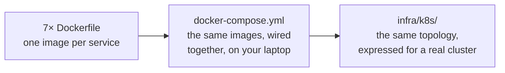
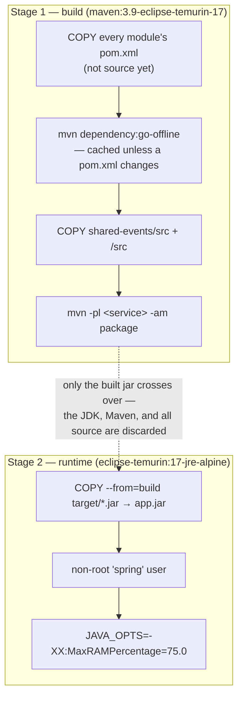
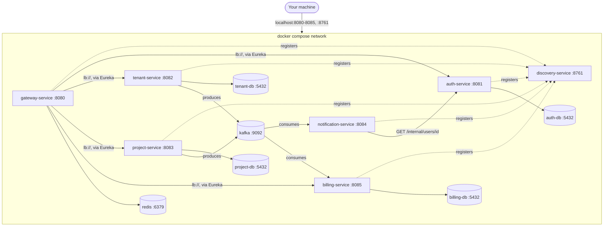
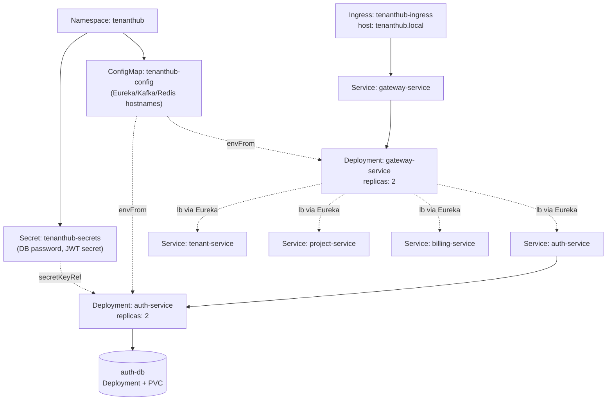
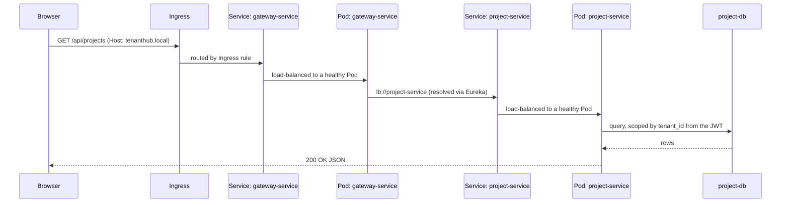

# TenantHub — Infrastructure

Everything needed to run TenantHub as containers: a `Dockerfile` per service, a
`docker-compose.yml` for the full stack on your own machine, and a Kubernetes manifest set
for a real cluster.

## Table of Contents

- [Overview](#overview)
- [Docker Images](#docker-images)
- [Local Stack — docker-compose](#local-stack--docker-compose)
- [Kubernetes](#kubernetes)
- [A Request, End to End](#a-request-end-to-end)
- [Status](#status)
- [Folder Structure](#folder-structure)

## Overview

There are three layers here, each building on the one before it:



The Dockerfiles decide **how each service is packaged**. Compose decides **how they talk
to each other locally**. Kubernetes decides **how they run, scale, and heal in
production**. None of the three invent new application behavior — each one just answers a
different question about the same 7 services.

## Docker Images

Every service directory has its own `Dockerfile`, all following the same two-stage shape:



The build context for every image is the **repo root**, not the service folder — 5 of the
7 services depend on the sibling `shared-events` module through Maven's multi-module
reactor, so the build needs to see the whole repo, not just one service directory:

```bash
# from the tenanthub/ repo root
docker build -f auth-service/Dockerfile -t tenanthub/auth-service:latest .
```

| Service | Dockerfile | Depends on `shared-events`? | Port |
|---|---|:---:|---|
| `discovery-service` | `discovery-service/Dockerfile` | No | `8761` |
| `auth-service` | `auth-service/Dockerfile` | Yes | `8081` |
| `tenant-service` | `tenant-service/Dockerfile` | Yes | `8082` |
| `project-service` | `project-service/Dockerfile` | Yes | `8083` |
| `notification-service` | `notification-service/Dockerfile` | Yes | `8084` |
| `billing-service` | `billing-service/Dockerfile` | Yes | `8085` |
| `gateway-service` | `gateway-service/Dockerfile` | No | `8080` |

## Local Stack — docker-compose

`docker-compose.yml` runs the whole system on one machine: 4 Postgres instances (one per
stateful service — deliberately not one shared database, matching the
database-per-service principle the whole architecture is built on), Kafka in single-node
KRaft mode (no Zookeeper), Redis, and all 7 services built from the Dockerfiles above.



Every hostname in that diagram (`auth-db`, `kafka`, `discovery-service`, ...) is a real
Docker Compose service name — containers resolve each other by name automatically,
which is the only thing that has to be overridden vs. running each service locally
(their `application.yml` defaults all point at `localhost`).

**Running it:**

```bash
cp infra/.env.example infra/.env     # fill in a real POSTGRES_PASSWORD / JWT_SECRET
docker compose -f infra/docker-compose.yml --env-file infra/.env up --build
```

`infra/.env` is gitignored — the compose file itself never contains a real credential,
same convention as `application.yml.example` → `application.yml` in every service.

| What | Container(s) | Notes |
|---|---|---|
| Databases | `auth-db`, `tenant-db`, `project-db`, `billing-db` | `postgres:16-alpine`, one per stateful service, healthchecked with `pg_isready` |
| Messaging | `kafka` | `apache/kafka:3.9.0`, KRaft mode, internal-only (no host port) |
| Cache / rate limit | `redis` | `redis:7-alpine`, healthchecked with `redis-cli ping` |
| Everything else | one container per service | built from each service's `Dockerfile` |

## Kubernetes

`infra/k8s/` is the same topology translated into Kubernetes objects — a shared
`ConfigMap`/`Secret` instead of a `.env` file, `Deployment`s instead of raw containers,
and an `Ingress` as the one external door in.



*(auth-service is the one fully expanded above; `tenant-service`, `project-service`,
`notification-service`, and `billing-service` follow the exact same
`Service → Deployment → ConfigMap/Secret` shape.)*

| File | Creates |
|---|---|
| `00-namespace.yaml` | The `tenanthub` namespace everything else lives in |
| `01-configmap.yaml` | Shared non-sensitive config (Eureka/Kafka/Redis hostnames) |
| `02-secret.yaml` | Template for DB password + JWT secret (placeholder values — see the file's own comments for how to set real ones) |
| `10`–`13-postgres-*.yaml` | One PVC + Deployment + Service per database (`auth`, `tenant`, `project`, `billing`) |
| `14-redis.yaml` | Redis Deployment + Service (no PVC — it's a cache) |
| `15-kafka.yaml` | Kafka Deployment + Service, same KRaft config as compose |
| `20-discovery-service.yaml` | Eureka, `replicas: 1` (it doesn't peer-register, so more replicas wouldn't add availability) |
| `21`–`26-*.yaml` | The 6 remaining app services — `replicas: 2`, readiness/liveness probes, resource limits, rolling updates |
| `30-ingress.yaml` | The external entry point, routing to `gateway-service` |

**Applying it** (requires a cluster — kind, minikube, or similar — plus an Ingress
controller such as `ingress-nginx` for the last file to do anything):

```bash
# build & load each image into your cluster first, e.g. for kind:
kind load docker-image tenanthub/auth-service:latest --name <cluster>

kubectl apply -f infra/k8s/
```

Apply order doesn't actually matter — a Deployment that starts before its ConfigMap
exists just restarts a few times until it does, which is the normal
declare-observe-reconcile loop Kubernetes runs on.

## A Request, End to End

Tracing `GET /api/projects` through the Kubernetes deployment:



Every arrow that says "Service" is doing the same one job: giving a stable name to a
Deployment's Pods, which come and go as they restart, scale, or roll out updates.

## Status

- **Docker images & docker-compose:** built and run end to end. All 13 containers come up
  healthy, all 6 app services register in Eureka, and requests through the Gateway
  correctly reach auth/tenant/project services with tenant/JWT security intact.
- **Kubernetes manifests:** written and YAML-valid, mirroring the exact same hostnames,
  images, and environment variables the compose stack already proved work — but not yet
  applied to a live cluster (no kind/minikube set up on the machine this was built on).

## Folder Structure

```
infra/
├── README.md               # this file
├── .env.example            # template for docker-compose secrets (copy to .env, gitignored)
├── docker-compose.yml       # full local stack
├── prometheus.yml           # (P7 — not wired up yet)
└── k8s/
    ├── 00-namespace.yaml
    ├── 01-configmap.yaml
    ├── 02-secret.yaml
    ├── 10-postgres-auth.yaml
    ├── 11-postgres-tenant.yaml
    ├── 12-postgres-project.yaml
    ├── 13-postgres-billing.yaml
    ├── 14-redis.yaml
    ├── 15-kafka.yaml
    ├── 20-discovery-service.yaml
    ├── 21-auth-service.yaml
    ├── 22-tenant-service.yaml
    ├── 23-project-service.yaml
    ├── 24-notification-service.yaml
    ├── 25-billing-service.yaml
    ├── 26-gateway-service.yaml
    └── 30-ingress.yaml
```
