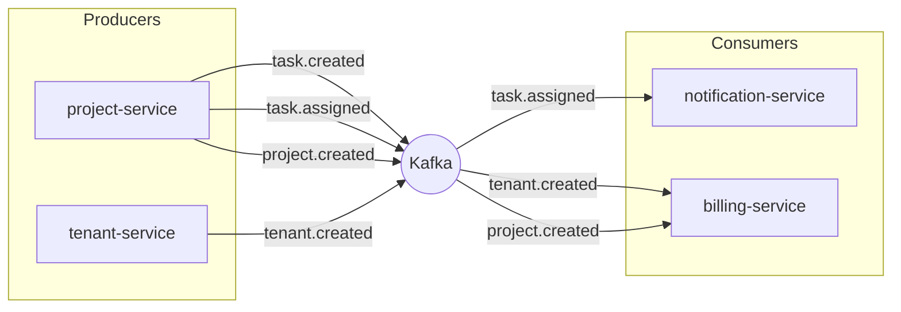
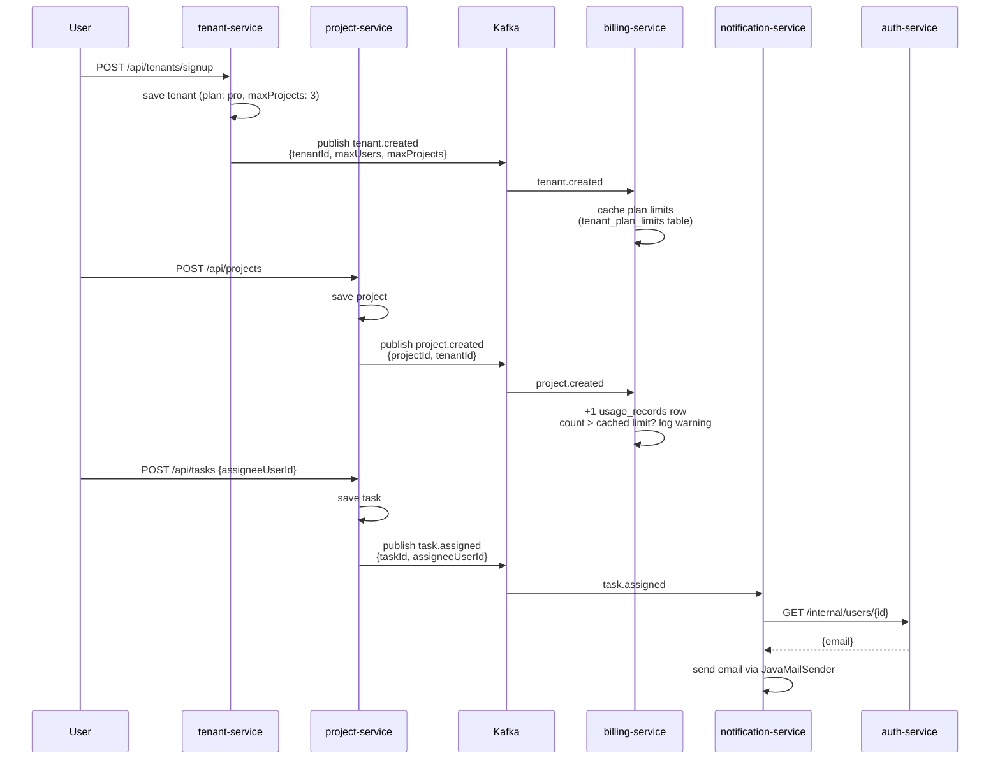
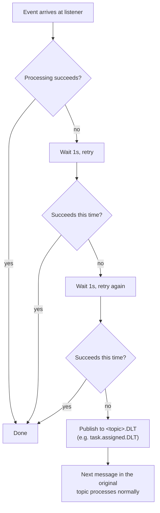

# shared-events

The event contract every Kafka producer and consumer in TenantHub depends on — plain
Java records, no Spring, no Kafka client code. This module doesn't do anything by
itself; it exists so `project-service`/`tenant-service` (producers) and
`notification-service`/`billing-service` (consumers) agree on exactly what an event
looks like without importing each other.

| | |
|---|---|
| Packaging | plain jar (no Spring Boot) |
| Contents | event records + `EventTopics` (topic name constants) |
| Depended on by | `project-service`, `tenant-service`, `notification-service`, `billing-service` |

## Why this exists

Per `tenanthub-architecture.html`: instead of Project Service directly calling
Notification Service ("send this email now"), it publishes an event and moves on.
Kafka delivers it to anyone listening — the producer never knows or cares who's
listening, or how many listeners there are.



## Event catalog

| Topic (`EventTopics`) | Event record | Published by | Consumed by |
|---|---|---|---|
| `task.created` | `TaskCreatedEvent` | `project-service` | *(nobody yet — published for a future consumer, see Known limitations)* |
| `task.assigned` | `TaskAssignedEvent` | `project-service` | `notification-service` — emails the assignee |
| `tenant.created` | `TenantCreatedEvent` | `tenant-service` | `billing-service` — caches the tenant's plan limits |
| `project.created` | `ProjectCreatedEvent` | `project-service` | `billing-service` — logs usage, checks against the cached limit |

Every event carries its own `tenantId`/relevant IDs and an `occurredAt` timestamp
(`java.time.Instant`). Messages are keyed by the entity's own ID (`taskId`,
`tenantId`, `projectId`) — same-entity events land on the same partition, so a
consumer group processes them in order relative to each other.

## End-to-end walkthrough

Two real flows, traced through every hop:



## Failure handling: retries then dead-letter

Both consumers (`notification-service`, `billing-service`) configure a
`KafkaErrorHandlingConfig` (`DefaultErrorHandler` + `DeadLetterPublishingRecoverer`).
A **real** failure (Auth Service unreachable, SMTP down, the consumer's own database
down) is retried, then given up on — it is never silently dropped and never retried
forever:



Two retries, 1 second apart, then the failed record is published to `<topic>.DLT`
(`task.assigned.DLT`, `tenant.created.DLT`, `project.created.DLT`) instead of blocking
every message behind it. **Nothing currently watches those `.DLT` topics** — no
replay tool, no alert — the message is safely stored, not lost, but nobody's notified.
That's a deliberate stopping point for this phase, not an oversight.

One thing that does *not* go through this path: "no user found for this
`assigneeUserId`" in `notification-service` is a valid business outcome (bad/stale
ID), not a failure — it's logged and skipped, no retry, no DLT. Retrying wouldn't
change the answer.

## Consumer configuration (both `notification-service` and `billing-service`)

```properties
spring.kafka.consumer.group-id=<service-name>
spring.kafka.consumer.value-deserializer=org.springframework.kafka.support.serializer.ErrorHandlingDeserializer
spring.kafka.consumer.properties.spring.deserializer.value.delegate.class=org.springframework.kafka.support.serializer.JsonDeserializer
spring.kafka.consumer.properties.spring.json.trusted.packages=com.tenanthub.events
# producer config below is for the DLT recoverer, not domain events - these
# services don't publish anything themselves
spring.kafka.producer.value-serializer=org.springframework.kafka.support.serializer.JsonSerializer
```

`ErrorHandlingDeserializer` wraps `JsonDeserializer` so a corrupt/unreadable message
gets the same retry → DLT treatment instead of permanently wedging the consumer
thread.

## Known limitations (by design, for now)

- **`task.created` has no consumer.** It's published (Project Service's own audit
  trail / future use), but nothing currently reacts to it. The use-case doc's "email
  on new comment" and "welcome email on tenant signup" use cases also aren't wired up
  — the first has no `comment.created` event yet, the second has no admin email
  captured at signup time (see `tenanthub-use-cases.html`).
- **Detection, not enforcement.** `billing-service` logs a warning when a tenant
  exceeds their plan's project limit — it does not, and cannot, stop
  `project-service` from creating it. That would need a synchronous call from
  `project-service` to `billing-service` *before* saving, which doesn't exist.
- **No Gateway/service-to-service auth.** `notification-service` calls
  `auth-service`'s `GET /internal/users/{id}` by direct URL, with nothing checking
  that the caller is actually `notification-service`. That's a P5 (Gateway/Eureka)
  concern.
- **Dead letters aren't monitored.** See above — messages land safely on `.DLT`
  topics, but nothing alerts on them or replays them yet.
